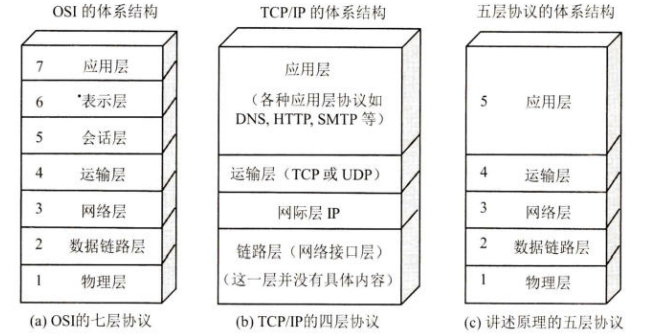

# 1、概述

作者：Hongtauo

GitHub主页：[Hongtauo · GitHub](https://github.com/Hongtauo)

参考书目：《计算机网络（第八版）》作者：谢希仁

说明：本博客是本人学习过程中对于课程内容的总结与理解，部分章节有引用的部分已经在各章节开头处标明，仅作学习使用，后续更新会结合考研408关于计网的内容

---

* 21世纪最重要的特征是：数字化、网络化、信息化
* 三网合一是指：电信网络、有线电视网络、计算机网络
* 计算机网络的定义：由若干节点和连接这些节点的链路组成
* 互联网概述

  * 互联网：多个网络通过路由器相互连接起来，构成一个覆盖范围更大的网络，因此互联网是”网络的网络“
  * 网络把许多计算机连接在一起，而互联网则把许多网络通过一些路由器连接在一起，与网络相连的计算机称为主机
  * 互联网基础结构发展的三个阶段

    * 第一阶段
    * 第二阶段
    * 第三阶段
  * **指定互联网的正式标准要经过四个阶段**

    * 互联网草案
    * 建议标准
    * 草案标准
    * 互联网标准

    注：现在指定互联网标准的过程简化为：建议标准->互联网标准
* 互联网的组成

  * 边缘部分

    所有连接在互联网上的主机构成的，这部分是用户直接使用的，用来进行通信和资源共享

    * 客户-服务器模式
    * 对等连接方式
  * 核心部分

    由大量网络和俩边界这些网络的路由器组成，这部分是为边缘部分提供服务的，关键词：路由器、报文转发

    * 电路交换的主要特点
    * 分组交换的主要特点
* 不同类别的计算机网络

  * 按照网络的作用范围分类：

    * 广域网WAN
    * 城域网MAN
    * 局域网LAN
    * 个人区域网PAN
  * 按照网路的使用者进行分类

    * 公用网
    * 专用网
  * 用来把用户接入到互联网的网络

    * 接入网
* 计算机网络的性能指标

  * 速率

    网络技术中的速率指的是数据的传送速率，也叫做数据率或比特率，单位是bit/s
  * 带宽

    在计算机网络中，带宽指的是某信道能通过的“最高数据率”，单位是bit/s
  * 吞吐量

    表示在某个单位时间内通过某个网络的实际数据量
  * 时延

    1. 发送时延（也叫传输时延）

        发送时延是主机或路由器**发送数据帧**所需要的时间

        $$
        发送时延=\frac{数据帧长度\left(bit\right)}{发送速率\left(bit/s\right)}
        $$
    2. 传播时延

        传播时延是电磁波在信道中传播一定的距离需要花费的时间

        $$
        传播时延=\frac{信道长度(m)}{电磁波在信道上的传播速率\left(m/s\right)}
        $$

        发送时延主要是发生在发生在机器内部，与传输的信道的长度没有任何关系，传播时延则发生在信道上，与信号的发送速率无关
    3. 处理时延

        主机或者路由器在收到分组的时候要花费一定的时间进行处理，例如分析分组的首部，从分组中提取数据部分、进行差错校验或查找转发表，这就产生了处理时延
    4. 排队时延

        分组在经过网络传输的时候，要经过许多路由器，每个路由器中都有设置输入队列、输出队列、在队列中的时间就是排队时延
    5. 总时延

        $$
        总时延=发送时延+传播时延+处理时延+排队时延
        $$
  * 时延带宽积
  * 往返时间RTT
  * 利用率
* 网络的非性能指标

  * 费用
  * 质量
  * 标准化
  * 可靠性
  * 可拓展性和可升级性
  * 易于管理和维护
* 计算机网络的体系结构

  ​​

  * OSI七层协议
  * TCP/IP四层协议
  * 五层体系结构

    * 应用层
    * 传输层
    * 网络层
    * 数据链路层
    * 物理层
* 实体、协议、服务和服务访问点

  * 实体

    实体是发送或接收信息的硬件或软件进程
  * 协议

    协议是控制两个对等实体（或多个实体）进行通信的规则的集合
  * 服务

    在协议的控制下，两个对等实体间的通信使得本层能够向上一层提供服务，要实现本层协议，还需要使用下面一层所提供的服务

    * 协议是水平的，服务是垂直的
    * 协议的实现保证了能够向上一层提供服务，使用本层服务的实体只能看见服务而无法看见下面的协议，协议对上面的实体是透明的
  * 服务访问点

    在同一系统中相邻两层的实体进行交互（交换信息）的地方
