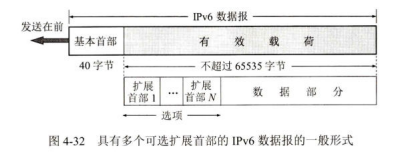

# 4、网络层

作者：Hongtauo

GitHub主页：[Hongtauo · GitHub](https://github.com/Hongtauo)

参考书目：《计算机网络（第八版）》作者：谢希仁

说明：本博客是本人学习过程中对于课程内容的总结与理解，部分章节有引用的部分已经在各章节开头处标明，仅作学习使用，后续更新会结合考研408关于计网的内容

---

引用说明：

[1][NAT网络地址转换 - 知乎 (zhihu.com)](https://zhuanlan.zhihu.com/p/157769590)

[2]子网掩码的计算

网络层解决的是**网络间的互连问题**，核心内容为**网际协议**——IP，在数据链路层和物理层中，所描述的网络都是同一个网络，而网络层解决的是不同网络之间的通信问题

---

# 网络层的概念

## 网络层向传输层提供的服务

网路层向上提供的是简单的、灵活的、尽最大努力交付的数据报服务，网络层**不提供服务质量的承诺**，由于传输网络不提供端到端的可靠传输服务，这就使得网络的路由器比较简单，价格相对低廉

## 网络的两个层面

1. 路由器之间**传送的信息**有以下两大类

    * 分组转发——转发源主机和目的主机之间所传送的数据
    * 路由选择——传送路由器信息

2. 软件定义网络SDN

    软件定义网络SDN取消了路由器中的路由选择软件，使用在逻辑上集中的远程控制器掌握各主机和整个网络的运行状态，为每一个分组计算出最佳路由，然后在每一个路由其中生成正确的转发表

# 网际协议IP

与IP协议配套的有三个协议

* 地址解析协议ARP
* 网际控制报文协议ICMP
* 网际组管理协议IGMP

其中，IP使用的是ARP地址解析协议，用于**根据IP地址获取物理地址**，网际控制报文协议ICMP和网际管理协议IGMP要使用IP协议，所以更准确直观的图应该是这样的

## 虚拟互联网络

虚拟互联网络就是**逻辑互联网络**，虽然互联起来的各种物理网络的异构性是客观存在的，但是利用IP协议可以使这些性能各异的网络在网络层上看起来好像是一个统一的网络，如果在这种的覆盖全球的IP网的上层使用TCP协议，那么就是现在的互联网

## IP地址

整个的互联网是一个**单一的**、**抽象的**网络，IP地址就是给连接到互联网上的每一台主机或路由器的每一个接口，分配一个在**全球范围内是唯一的32位的标识符**，IP地址的结构很方便我们在互联网上进行寻址，IP地址由互联网名字和数字分配机构ICANN分配

### IP地址表示法

关键词：点分十进制表示法

IPV4采用32位二进制表示，32位的地址中分为两个部分——网络号和主机号

* 网络号

  网络号标志着主机或路由器所连接的网络，一个网络号在整个互联网范围内必须是唯一的
* 主机号

  主机号标志的是主机，对于路由器来说，标志的是路由器，一个主机号在所连接的网络中必须是唯一的

IP在整个互联网范围内是唯一的（IPV4的话公网地址是唯一的），IP地址表示如下

$$
IP地址::=\left \{<网络号>,<主机号>  \right \}
$$

若前n位为网络号，则32-n位表示主机号

### 分类的IP地址

互联网早期采用的是分类的IP地址

* A类地址的网络号字段为8位，占1个字节，**字段第一位固定为0**，故可供使用的有7位

  * **网络号**

    * 网络号全为0的IP地址表示“本网络”
    * 网络号为“<u>01111111</u>”的127.x.x.x的保留作本地软件的环回测试

    所以，A类地址可用的网络号为$2^7-2=126$个
  * **主机号**

    * A类地址的主机号共有3字节，24位
    * 全0的主机号表示该IP地址是“本主机”所连接到的单个网络地址
    * 全1表示“所有的”，即该网络上的所有主机

    所以，A类地址的主机号总共有$2^{24}-2=16777214$个
* B类地址的网络号字段为16位，占2个字节

  * 网络号

    * 可指派$2^{14}$个网络数（实际上应该是$2^{14}$-1，128.0.0.0不指派）
  * 主机号

    * **可指派**​$2^{16}-2$**​**个主机数**

      * 全0的主机号表示该IP地址是“本主机”所连接到的单个网络地址
      * 全1表示“所有的”，即该网络上的所有主机
* C类地址的网络号字段为24位，占3个字节

  * 网络号

    * 可指派$2^{21}$个网络数（实际上应该是$2^{21}$-1，192.0.0.0不指派）
  * 主机号

    * **可指派**​$2^{8}-2$**​**个主机数**

      * 全0的主机号表示该IP地址是“本主机”所连接到的单个网络地址
      * 全1表示“所有的”，即该网络上的所有主机

**总的来说**，除了A类网络的网络号要去掉两个保留的地址外，其余两类网络的可指派网络数均为  $2^{主机号位数-字段长}$ ，三类地址的主机号都要分别去掉各自全0或全1的主机号 $2^{主机号位数}-2$  

#### 子网掩码的计算

##### 已知子网数，求子网掩码

1. 将需要划分的子网数转换为二进制表示
2. 计算该二进制的位数N
3. 写出该子网所属大网络的子网掩码
4. 将子网掩码的主机位部分的前N位置1

##### 已知主机数，求子网掩码

1. 将主机数转换为二进制表示
2. 计算该二进制的位数N
3. 写出该子网所属大网络的子网掩码
4. 将主机位部分全部置为1
5. 将置为1的主机位部分的后N位置为0

### 无分类编址CIDR

为了缓解IP地址枯竭的问题

#### 网络前缀

无分类编址CIDR采用**斜线记法**来表示网络前缀

$$
IP地址::=\left\{  <网络前缀>,<主机号>\right\}
$$

网络前缀是不定长的，在IP地址后面使用“/位数”来表示网络前缀有多长，比如“128.14.35.7/20”表示前20位为网络前缀，后12位表示主机号

#### 地址块

网络前缀都相同的所有连续IP地址组成一个“CIDR”地址块，一个地址块中包含的IP地址数目取决于网络前缀的位数，注意，可指派的地址数要去掉主机号全为0和全为1的两个

#### 地址掩码

地址掩码又叫做address mask，谜底是为了让计算机能够快速的计算出网络地址，将IP地址与地址掩码按位进行与运算，相当于将地址掩码中的全1部分的对应位置的IP地址保留，舍弃全0部分的IP地址

比如，/20地址块的地址掩码为 11111111 11111111 11110000 00000000 ，由前面20个连续的1和后面12个连续的0构成

#### 三个特殊的地址块

略

### IP地址的特点

1. IP地址是一种分等级的地址结构，IP管理机构只需要分配网络前缀即可，剩下的主机号可以自行分配，同时路由器在转发的时候只需要关注目的主机所连接的网络前缀，降低了转发表所占用的存储空间，缩短查表转发的时间
2. IP是标志着一台主机或路由器和一条链路的接口，当一台主机同时连接到两个网络上的时候，该主机就必须同时具有两个相应的IP地址，其网络前缀必须是不同的，这个主机叫做多归属主机
3. 一个网络必须是具有相同网络前缀的主机的集合

    1. 所以物理层使用集线器扩大的网络本质上还是属于同一个网络
    2. 数据链路层使用的交换机连接起来的网络依旧是同一个网络，只是把网络的范围扩大了
    3. 具有不同网络前缀的局域网必须使用路由器进行互联
4. IP地址中，所有分配到网络前缀的网络都是平等的

注意：工作在数据链路层的交换机没有IP地址，只有MAC地址

### IP地址与MAC地址

* 硬件地址

  * MAC地址是**固化在**网卡上的ROM中的，MAC地址也叫做物理地址或硬件地址，**地址长度为48位**
  * MAC地址用于在网络中唯一标示一个网卡，一台设备若有一或多个网卡，则每个网卡都需要并会有一个唯一的MAC地址

  * 前24位由IEEE（电气和电子工程师协会）决定如何分配，后24位由实际生产该网络设备的厂商自行制定。
* 逻辑地址

  * IP地址是网络层和以上各层使用的地址，是逻辑地址，用软件实现的

IP地址放在IP数据报的首部，而MAC地址放在MAC帧的首部，在网络层及以上的使用的是IP地址，而数据链路层及以下的使用的是MAC地址，当IP数据报插入到数据链路层的MAC帧后，整个IP爱数据报就成为了MAC帧的数据，数据链路层是看不到IP数据报的IP地址的

注意：

* 在IP层抽象的互联网上只能看到IP数据报
* 路由器忽视IP数据报首部的IP源地址，只根据目的站的IP地址进行转发
* 在局域网的数据链路层只能看到MAC帧
* IP向下屏蔽了下层的复杂细节，向上进行抽象，使得网络层及以上的设备不需要关心通信的具体实现而使用统一的、抽象的IP地址研究主机和主机或路由器之间的通信

### 地址解析协议ARP

地址解析协议ARP的任务是，在主机的ARP高速缓存中存放一个从IP地址到MAC地址的映射表，从而解决从IP到MAC的转换问题，这个映射表会经常的动态更新，对于网络中新加入或者撤走的主机能够进行及时的更新

#### ARP cache的作用与更新

当主机A向本局域网上的某台主机B发送IP数据报的时候，先在其ARP高速缓存中查看有无主机B的IP地址

* 若找到

  * 则在ARP的高速缓存中查出其对应的MAC地址，再把这个地址写入MAC帧，然后通过局域网把该MAC帧发往此MAC地址
* 若未找到

  有可能是主机B才入网，或者是A刚通电，缓存暂时为空，则A执行ARP，查找B的MAC地址

  * ARP进程在局域网上发送一个ARP请求分组
  * 在本局域网上的所有主机运行的ARP进程都收到此ARP请求分组
  * 主机B的IP地址与ARP请求分组中要查询的IP地址一致，就收下这个ARP请求分组（其余主机丢弃此分组），向主机A发送ARP响应分组，同时在这个ARP响应分组中写入自己的MAC地址
  * 主机A收到主机B的ARP响应分组后，就在其ARP缓存中写入主机B的IP地址到MAC地址的映射

注意：

* ARP请求分组是广播发送的，而ARP响应分组是普通的单播，因为B已经知道了A的MAC地址，同样的，B也会记录下A的IP到MAC的映射在自己的缓存中（避免了B再询问A而浪费时间）
* ARP缓存中的映射地址都有一个生存时间，超过生存时间的项目就从高速缓存中删除，以便能够即使发现网络中的主机变动，通过ARP请求分组进行更新
* ARP用于解决同一局域网上的主机或路由器的IP地址和MAC地址的映射问题（实际上在不同局域网上的通信中，本地主机并不需要知道远程主机的MAC地址，毕竟**寻路是路由器的功能**，而IP到MAC的解析是自动的，对用户透明的）

#### 使用ARP的四种典型情况

1. 同一网络下，主机A要把数据报发送给主机B

    和前面描述的一样，主机A会广播ARP请求分组，然后找到目的主机B的MAC地址
2. 不同网络下，主机A要把数据报发送给主机B

    主机A广播ARP请求分组，找到和主机A同一网络下的路由器R的MAC地址，由路由器R完成后续工作 2. 3.
3. 同一网络下，路由器R要把数据报发送给主机C

    此时，路由器R在本网络中广播ARP请求分组，找到本网络中的目的主机C的MAC地址
4. 不同网络下，路由器R要把数据报发送给主机C

    路由器R在本网络中广播ARP请求分组，获取本网络中的另一个路由器R'的MAC地址，剩下的工作交给R'完成

#### 为什么需要同时使用IP地址和MAC地址进行通信

似乎主机间的通信看起来都是MAC地址进行通信，那么为什么不直接使用MAC地址而免除使用ARP呢？又或者说，为什么不干脆使用IP地址代替掉MAC地址呢

1. IP编址解决了对分布在全世界的以太网中的MAC地址的寻址难题，向上抽象，使得任何设备之间好像是连在一个网络中一样
2. 不同规格网络使用的是不同的MAC地址，如果直接使用MAC地址进行通信，则需要极其复杂的MAC地址转换工作
3. IP地址划分时基于地理区域，换了不同地方，即便是同一台硬件设备，IP地址一定不一样，可以理解为和地理位置有关；而MAC地址不依赖于地理区域，换了不同地方，只要还是同一台硬件设备，MAC地址就不会变，它只和硬件设备有关。
4. 不是所有的设备都有IP地址，比如交换机

### IP数据报的格式

IP数据报由两个部分组成：首部和数据部分，发送的时候从首部开始发送

#### IP数据报首部的固定部分

**IP数据报首部固定部分占20字节**

1. 版本

    占4位，指明IP协议的版本
2. 首部长度

    占4位，可表示的最大二进制数值是15 ，单位是**​ 32位字长（4字节）**
3. 区分服务

    占8位
4. 总长度

    总长度指首部和数据之和的长度，单位为字节，总长度字段为15位，所以数据报的最大长度位$2^{16}-1=65535$字节
5. 标识

    占16位，计数器赋予给标识片段
6. 标志

    占3位

    * 最低位位MF

      * MF=1表示后面还有分片
      * MF=0表示这是若干数据报片段的最后一个
    * 中间位为DF

      * DF=1表示不能分片
      * DF=0表示允许分片
7. **片偏移**

    占13位，片偏移以8个字节为偏移单位。

    例子：一个数据报的总长度为3820字节，其数据部分为3800字节长（使用固定首部），需要分片为长度不超过1420字节的数据报片。

    由于采用固定首部，所以每个数据报片的数据部分长度为1420-20=1400

    将数据部分长为3800的数据进行分片，需要分三片，分别是1400，1400，1000

    ​​

    ​​
8. 生存时间

    占8位，英文表示为TTL
9. 协议

    占8位
10. 首部校验和

     占16位，**只检验IP数据报的首部**，而不包括数据部分
11. 源地址

     占32位
12. 目的地址

     占32位

#### IP数据报首部的可变部分

是一个可选字段，用于支持排错、测量、以及安全等措施

# IP层转发分组的过程

## 基于终点的转发

1. 路由器中的转发表存储的只是网络前缀的信息
2. 当路由器收到一个待转发的分组后，从转发表中得出下一跳的路由器IP地址，然后交送给数据链路层的网络接口软件，通过ARP转换将IP转换为MAC地址，将这个MAC地址放在MAC帧的首部，然后利用这个MAC地址传送到下一跳路由器的链路层
3. 当该路由器收到上一路由器的MAC帧后，数据链路层将MAC帧中的数据取出，交付给网络层，然后再重复2.的操作，直到送达目标主机

总结：ARP只是负责相邻两个路由器/主机之间的**接力**，每次都需要**路由器**解包MAC帧，查找下一跳并转换为MAC地址写入MAC帧首部送入数据链路层，再传输MAC帧到下一跳路由，所以路由器起到的是“寻路”的作用，而MAC地址则是负责两两节点间的交付，IP屏蔽了网络层以下的具体实现，使得不同网络间的通信变得简单。

注意：只有**网络前缀相同的才是同一网络**

## 最长前缀匹配

略

## 二叉线索表查找转发表

略

# 网际控制报文协议ICMP

ICMP是装在IP数据报中，作为其数据部分，所以ICMP是IP层的协议，任务是更有效的转发IP数据报和提高交付成功的机会

​​

## 种类

ICMP分为ICMP差错报告报文和ICMP询问报文

前4个字节是统一的格式，类型由8位二进制表示，代码由8位二进制代码表示，代码进一步标识了某种类型中的不同情况，校验和字段用来检验整个ICMP报文

1. 差错报告报文

    * 终点不可达
    * 时间超过
    * 参数问题
    * 改变路由（重定向）

      由于主机网络远大于路由器网络，所以**主机不和连接在网络上的路由器定期交换路由信息**​

      1. 主机最开始会在转发表中设定一个默认路由
      2. 主机的所有数据报一律发送给这个默认路由，由这个默认路由处理后续操作
      3. 这个默认路由因为与网络上的其他路由定期交换路由信息，所以这个默认路由知道每一个目的网络的最佳路由
      4. 如果这个默认路由发现主机发往某个目的地址的数据报的最佳路径应经过网络上的另一个路由器R，就发送ICMP改变路由报文告诉主机
      5. 主机接收到这个报文后，在自己的转发表中增加这一项，然后以后的到达这个目的地地址的报文就经过新的路由R
2. 询问报文

    * 回送请求或回送回答
    * 时间戳请求或时间戳回答

## 应用

ICMP的一个重要的应用就是分组网间探测 PING，用于探测主机之间的连通性，PING使用了ICMP的回送请求与回送回答报文，PING是应用层直接使用网络层的一个例子，没有通过运输层的TCP或UDP

* windows下的命令
* UNIX下的命令

# IPV6

为了解决IPV4的地址资源枯竭问题，而提出的根本措施——采用更大地址空间的新版本的IP，也就是IPV6

## IPV6数据报

IPV6仍然支持无连接的传送，但是其协议数据单元PUD称为分组，而不是IPV4中的数据报，本章中仍然将数据报与分组视为同一事物

### IPV6的改变

1. 更大的地址空间

    IPV4的长度为32位，而IPV6增大到128位，拓展了4倍，其地址空间增大了$\frac{2^{128}}{2^{32}}=2^{96}$倍
2. 拓展的地址层次更灵活
3. 灵活的首部格式
4. 改进的选项
5. 允许协议继续扩充
6. 支持即插即用

    支持自动配置，不需要DHCP
7. 支持资源的预分配
8. IPV6首部改为8字节对齐

### 组成

IPV6的数据报由两大部分组成：

* 基本首部
* 有效载荷

  有效载荷允许扩展多个拓展首部，拓展首部的后面是数据部分

  注意：拓展首部不属于基本首部部分

### 首部中各字段的作用

* 版本

  IPV6的版本为6
* 通信量类
* 流标号

  IPV6提出流的概念，“流”，英文名叫“flow”，就是互联网上从特定源点到特定终点（单播或多播）的一系列数据报，这个“流”所经过的路径上的路由器都保证指明的质量服务，对实时类的任务如音频流，视频流提供了高质量的服务

* 有效载荷长度
* 下一首部
* 跳数限制
* 源地址

  占128位，是数据报发送端的IP地址
* 目的地址

  占128位，是数据报接收端的IP地址

### IPV6的地址

1. 单播
2. 多播
3. 任播

IPV6使用冒号十六进制记法

## IPV4到IPV6的过渡

### 双协议栈

使用域名系统DNS进行查询

* 若返回的是IPV4地址则双协议栈的源主机就使用IPV4地址
* 若返回的是IPV6地址则双协议栈的源主机就使用IPV6地址

缺点：

代价太大

### 隧道技术

隧道技术就是在IPV6数据报要进入IPV4的网络的时候，将其封装为IPV4数据报，要使双协议栈的主机知道IPV4数据报里面封装的是一个IPV6数据报，需要在IPV4的首部协议字段中设置值为41

## ICMPv6

略

# 互联网的路由选择协议

路由选择协议规定了互联网中有关的路由器如何互相交换信息并生成路由表

1. 理想的路由选择算法

    路由选择协议的核心就是路由算法，路由算法应该尽可能地接近于理想算法，在不同的场景下可以有不同的侧重

    1. 算法必须是完整的和正确的
    2. 算法在设计上应简单
    3. 算法能适应通信量和网络拓扑的变化

        1. 非自适应路由选择

            也叫做静态的路由选择策略，不能根据网络的通信量或拓扑自适应地进行调整
        2. 自适应路由选择

            也叫做动态的路由选择策略，能根据网络的通信量或拓扑自适应地进行调整，但是较为复杂，开销较大
    4. 算法应该具有稳定性
    5. 算法应该是公平的
    6. 算法应该是最佳的
2. 分层次的路由选择协议

    互联网采用的主要是自适应的、分布式的路由选择协议，由于互联网的规模十分地庞大，且部分单位不希望自己的内部网络暴露在互联网上，所以可以把互联网划分为许多个自治系统AS，每一个AS对外表现为一个单一的、一致的路由选择策略，所以，路由选择协议可以分为以下两类：

    1. 内部网关协议

        * RIP
        * OSPF
        * IS-IS
    2. 外部网关协议

        * EGP

          * BGP

    自治系统之间的路由选择叫做域间路由选择，自治系统之内的路由选择叫做域内路由选择

## 内部网关协议

### RIP协议

* 是一种分布式的基于距离向量的路由选择协议
* 最大跳数为15跳，每经过一个网络，跳数+1
* 只适用于小型网络
* RIP不支持在两个网络之间同时使用多条路由，RIP选择的是最少网络数的路由，这样会忽略网络的速度与时延都较优但跳数多的网络

#### 协议工作原理

1. 仅和相邻路由交换信息
2. 路由器交换的信息是当前本路由器知道的全部信息，即自己现在的路由表
3. 按照固定的时间间隔交换信息

#### 距离向量算法

对每一个相邻路由器发来的RIP报文：

1. 首先修改此报文中的“距离”与“下一跳路由器”

    1. 对所有的“距离”+1
    2. 将所有的“下一跳路由”改为**发送这条报文的路由器**

    这里有点回溯法的味道了

    也就是说，假设路由器A和路由器B是相邻路由器，路由器A给路由器B发了条信息：“从我这里到达目的网络D需要经过路由器C，路程总长为5”，那么路由器A就在自己的小本本上先算一算“从我（路由器B）到路由器A的距离是1，我的下一跳路由器应该是B，所以路程总长度为6，Y的话与我无瓜，我只要能够到B就行了”，注意，这个时候路由器A还没有将这条记录更新到自己的路由表中，因为还需要和已经存在的记录进行对比，才知道哪些已存在的记录需要被更新
2. 然后检查**本路由器**原有的路由表

    1. 检查“目的网络”一项，将原路由表没有的 “**目的网络”**的**项目**插入

        还是上面的例子，假如B给A发了个信息“现在有一条到目的网络E的路线，我（路由器B）的下一跳是路由器H，路径总长是3”，路由器A在自己的小本本上算了算“从我（路由器A）到目的网络E的总路径长应该是4，那么我只需要知道B能到目的网络就行了，所以将这条记录“经过路由器B的路径长度为4可以到达目标网络”插入到转发表
    2. 对于已有的“目的网络”，检查“下一跳地址”

        1. 若下一跳地址是**发送这条报文的路由器**，则把刚收到的项目替换掉原有路由表中的项目
        2. 若下一跳地址不是**发送这条报文的路由器**，则检查**收到的项目**与**原有路由表**中的“距离”

            1. 若**收到的项目**中距离小于**原有路由表**中的距离，则替换掉**原有路由表**中的项目
            2. 反之不替换
3. 若三分钟（120s）内没有收到相邻路由器更新的路由表，则把此相邻路由器标记为不可达的路由器，距离设置为16

#### 坏消息传播的慢

RIP存在的一个问题是，当网络出现故障的时候，要经过比较长的时间才能将此信息传送到所有的路由器

如图所示，由于存在路由器从某一接口接收到信息，然后又将此信息再通过此接口反向发送，造成了相邻路由之间套娃的情况，所以网net1不可达的信息要等到路由器A路由器B均将距离更新到16时才发现

* 好消息传播的快
* 坏消息传播得慢
* 实现简单，开销较小
* RIP报文作为运输层用户数据报UDP的数据部分进行传送（使用UDP端口号520）

### OSPF协议

也叫开放最短路径优先，采用了Dijkstra提出的最短路算法SPF，最主要的特征是使用链路状态协议，而不像RIP采取的距离向量协议

* 向本自治系统中所有路由器发送信息

  采用洪泛法，路由器通过**所有输出端口向所有相邻路由器发送信息**，而每一个相邻的路由器又再将此信息发往其所有的相邻路由器（但不再发给刚刚发来信息的路由器）
* 发送的信息就是与本路由器相邻的所有路由的链路状态，但只是路由器所知道的部分信息
* 当链路状态发生改变或者每隔一段时间，路由器向所有路由器采用洪泛法发送路由器的链路状态信息

通过各路由器频繁地交换链路状态信息，所有的路由器最终都能建立一个链路状态数据库，这个数据库是全网的拓扑结构图且在全网范围内是一致、同步的。每个路由器都知道全网有多少个路由器，哪些路由器是相连的，代价是多少，其更新过程收敛快。

#### OSPF如何用于规模很大的网络

在算法中，我们学过，如果我们要解决一个很复杂的问题，我们可以尝试分而治之的方法，通过对简单的子问题的求解，最终求解得复杂原问题的解，试想一下，一个庞大的公司，会划分很多职能不同的部门，然后不同的部门内又划分为不同的项目组，每个项目组又会划分几个项目团队，OSPF也是如此，将一个自治系统再划分为若干个更小的区域，每个区域采用32位的区域标识符表示（每个区域一般不超过200各路由器）

* 通过区域的划分，每个区域中的路由器只知道本区域的网络拓扑
* 在采取洪泛法更新信息的时候，不必对整个自治区域进行洪泛法更新，而是将洪泛法更新的区域限制在每个区域内，减少了整个网络上的通信量
* OSPF采取层次结构的区域划分，在上层区域的叫做**主干区域**，主干区域的标识符规定为0.0.0.0
* 每个区域的信息由该区域的**区域边界路由器**概括，每个区域必须至少有一个**区域边界路由器**
* 区域边界路由器将信息汇聚至**主干区域**
* 在**主干区域**内的路由器叫做**主干路由器**，**主干路由器**可以同时是**区域边界路由器**
* 在主干区域还需要一个专门的路由器用于与其他自治区域交换信息，这个路由器叫做**自治系统边界路由器**

#### OSPF的特点

* 允许管理员为每条路径指派不同的代价
* 如果到达同一个目的网络有多条相同代价的路径，那么可以将通信量分配给这几条路径，这叫做多路径间的**负载均衡**
* 所有OSPF路由器之间交换的分组都具有鉴别的功能，因而保证了仅在可信赖的路由器之间交换链路状态信息
* OSPF支持长度可变的子网划分和无分类的编址CIDR
* 由于网络中的链路状态可能经常发生变化，因此OSPF让每一个链路状态都带上一个32位的序号，序号越大越新

#### OSPF的五种分组

* 问候分组
* 数据库描述分组
* 链路状态请求分组
* 链路状态更新分组
* 链路状态确认分组

OSPF分组是作为IP数据报的数据部分传送的，与RIP采用UDP传送不同，OSPF直接采用IP数据报传送（其IP数据报协议字段值位89），OSPF构成的数据报很短，可以减少路由信息的通信量，而且不必将长的数据报分片传送（避免了因为一个分片丢失而导致整个数据报重传的情况）

##### 问候分组

OSPF规定，每隔10秒钟都，每两个相邻的路由器都要交换一次问候分组，这样就能确定哪些临站是可达的，对于相邻路由器来说，可达是最基本的要求，网络中绝大部分分组都是问候分组，若40秒没有收到某个相邻路由器发来的问候分组，则可认为该相邻路由器是不可达的。，则应该立即修改链路状态数据库，重新计算路由表

##### 同步

其余四种分组都是用来同步链路状态数据库的，两个完全同步的路由器叫做“完全临接的”路由器，不是完全邻接的路由器表明虽然他们物理上是邻接的，但是其链路状态数据库并没有达成一致

##### 可靠的洪泛法

* 在路由器刚开始工作的时候

  1. 让每一个路由器用数据库描述分组和相邻路由器交换本数据库中已有的链路状态的摘要信息
  2. 路由器使用链路状态请求分组，向对方发送请求自己所缺少的某些链路状态项目的详细信息

      这样就避免了将全部信息都进行转发而造成的网络开销过大
* 在网络运行的过程中

  1. 当网络中一个路由器的链路状态发生变化，就使用链路状态更新分组
  2. 采用可靠的洪泛法进行更新

      可靠的洪泛法指的是收到更新分组后要发送确认（重复的更新分组只需要发送一次确认）
  3. 为了保持链路状态数据库与全网的状态保持一致，OSPF规定在一段时间内要刷新一次数据库中的链路状态

## 外部网关协议

BGP-4

### 主要特点

BGP采用了路径向量路由选择协议

### BGP路由

‍

### 路由选择

BGP路由选择算法

#### 本地偏好值最高

在BGP路由中属性里有一个选项叫本地偏好，本地偏好也就是本地优先，从本AS开始，到同一前缀的不同BGP路由中，挑选一个较好的（偏好值最高的）路由

#### AS跳数最少

根据经过的AS跳数选择BGP路由

#### 热土豆路由选择算法

对于当BGP路由的本地偏好相同、经过的AS个数相同的情况下，采用热土豆算法，也就是尽快将分组从当前AS中离开，也就是找到最近的边界路由器（转发数最少的边界路由器），将分组发送出去

#### BGP标识符数值最小的路由

当以上几种方法都无法找出最好的BGP路由的时候，使用BGP标识符来选择路由

在BGP的报文中，首部有一个4字节的字段，用于存放BGP标识符，记作BGP ID，以无符号整数作为运行BGP路由器的唯一标识符，具有多个接口的路由器有多个IP地址，BGP ID使用路由器的IP地址中的数值最大的一个

### BGP报文

略

# IP多播

略

# VPN与网络地址转换NAT

## VPN

IP地址紧缺，一个机构能申请到的IP数量远远小于所拥有的主机数量，而且一个机构内无需把所有的主机设备都接入互联网，所以在内部使用的计算机就可以由本机构自行为其分配IP地址，这些IP地址只在本机构内有效，称为**本地地址**

### 专用地址

为了避免随意使用的本地地址与互联网中的某个IP地址重合，而产生二义性，所以，划出了一批IP地址作为专用地址，这些地址只能用于机构内部通信，不能用于和互联网上的主机通信，**在互联上的所有路由器，对目的地址是专用地址的数据报一律不进行转发**

* 10.0.0.0 \~ 10.255.255.255
* 172.16.0.0 \~ 172.31.255.255
* 192.168.0.0 \~ 192.168.255.255

采用这些地址的互联网叫做专用互联网或本地互联网，这些专用IP地址是可以重用的！

### 虚拟专用网

虚拟专用网就是在互联网上，两个专用网之间要进行通信，但是通信的内容不希望暴露在互联网上，那么可以使用加密技术，在效果上实现两个专用网的通信好像是在一条专用线路上的一样，显然，两个专用网要通过互联网发送数据，那么这两个专用网上的与互联网连接的路由器的出口地址必须是合法的全球IP地址，其与内部网络连接的接口地址就是对应专用网的本地地址。

从逻辑上看，A到B之间好像是一条直通的点对点线路，尽管之间经过了很多台路由器

* 内联网VPN
* 外联网VPN
* 远程接入VPN

都是基于TCP/IP协议的

## NAT

网络地址转换，为了解决在专用网内部的主机想要和互联网上的主机的通信，因为互联网上的路由器不能转发任何目的地是专用地址的数据报，所以NAT就充当了内部地址与合法的互联网IP地址转换的角色，同时也缓解了IP地址不足、网络攻击的问题

* 通过NAT路由器的通信必须由专用网内的主机发起
* NAT有n个全球IP地址的时候，专用网内最多可以支持n台主机接入互联网

  * 静态NAT

    > 将内部本地地址与内部全局地址进行一对一的明确转换。
    >
    > 这种方法主要用在内部网络中有对外提供服务的服务器，如WEB、MAIL服务器时。该方法的缺点是需要独占宝贵的合法IP地址。
    >
    > 如果某个合法IP地址已经被NAT静态地址转换定义，即使该地址当前没有被使用，也不能被用作其它的地址转换。
    >
  * 动态NAT

    > 将内部本地地址与内部全局地址进行一对一的明确转换。
    >
    > 这种方法主要用在内部网络中有对外提供服务的服务器，如WEB、MAIL服务器时。该方法的缺点是需要独占宝贵的合法IP地址。
    >
    > 如果某个合法IP地址已经被NAT静态地址转换定义，即使该地址当前没有被使用，也不能被用作其它的地址转换。
    >
* 使用端口号的NAT也叫网络地址与端口号转换NAPT

  > 复用地址转换也称为端口地址转换（Port Address Translation，PAT）
  >
  > 首先是一种动态地址转换。路由器将通过记录地址、应用程序端口等唯一标识一个转换。通过这种转换，可以使**多个内部本地地址同时与同一个内部全局地址进行转换**并对外部网络进行访问。对于只申请到少量IP地址甚至只有一个合法IP地址，却经常有很多用户同时要求上网的情况，这种转换方式非常有用。
  >
  > 理想状况下，一个单一的IP地址可以使用的端口数为4000个
  >

[1][NAT网络地址转换 - 知乎 (zhihu.com)](https://zhuanlan.zhihu.com/p/157769590)

# 多协议标签交换MPLS

略

# 作业题

1. 试说明IP地址与MAC地址的区别，为什么要使用这两种不同的地址

    答：

    IP地址是逻辑地址，MAC是物理地址，IP地址解决了跨网络的数据传输问题，而MAC地址只是在同一网络下实现数据传输，网络层屏蔽了网络层以下的数据传输问题，使得不同网络的主机传输数据的过程中就好像是在同一网络中传输数据一样
2. 一个数据报长度为4000字节（**固定首部长度**）,现经过一个网络传送，但此网络能够传送的最大数据长度为1500字节，试问应当划分为几个短些的数据报片？各数据报片的数据字段长度、片偏移字段和MF标志应该为何数值

    答：

    此网络最大能够传输的数据长度为1500字节，那么相对应的，每个数据报不能超过1500字节，即固定首部+数据部分=1500字节

    此数据报数据部分长度为4000字节，对其进行划分，即

    $$
    \frac{4000}{1480}\approx2...1040
    $$

    也就是需要分为三个片，每个片数据字段长度为1480，**片偏移**的计算公式为

    $$
    片偏移=\frac{该片第一个字节在原分组的相对位置}{8}
    $$

    |分片|数据字段长度|片偏移字段|MF标志|
    | ------| --------------| ------------| --------|
    |1|1480|0|1|
    |2|1480|1480/8=185|1|
    |3|1040|2960/8=370|0|
3. 已知路由器R1的转发表如下所示，试画出各网络和必要的路由器之间的拓扑连接，标注出必要的IP地址和接口，对不能确定的情况要进行指明

    路由器R1的路由表

    |地址掩码|目的网络地址|下一跳地址|路由器接口|
    | ----------| --------------| ------------| ------------|
    |/26|140.5.12.64|180.15.2.5|m2|
    |/24|130.5.8.0|190.16.6.2|m1|
    |/16|110.71.0.0|……|m0|
    |/16|180.15.0.0|……|m2|
    |/16|190.16.0.0|……|m1|
    |默认|默认|110.71.4.5|m0|

    

    路由器连接的是不同网段的网络，路由器的每一个端口的IP应当属于所连接网络的网段

    如上，路由器的转发表所示，路由器R1的三个端口分别连接了三个不同网段的网络

    R1 m0 -> 110.71.0.0/16

    R1 m1 -> 190.16.0.0/16

    R1 m2 -> 180.15.0.0/16

    而R1的下一跳路由器都是与R1通过这三个网络相连的，根据下一跳路由器我们可以了解到，总共由三个路由器与R1通过三个不同的网络相连

    R1 m0 -> 110.71.0.0/16 <-110.71.4.5 路由器 未知IP->其他网络

    R1 m1 -> 190.16.0.0/16 <-190.16.6.2 路由器 ····未知····>>目的网络130.5.8.0/24

    R1 m2 -> 180.15.0.0/16 <-180.15.2.5 路由器 ····未知····>>目的网络140.5.12.64/26

    所以，可以画出上图的网络拓扑图，尽管R1知道通过下一跳可以到达目的网络130.5.8.0/24，但是具体的转发R1不需要知道，R1只需要知道自己将数据交付给R1的下一跳路由器即可
4. 某单位分配到一个地址块136.23.16.64/26，现在需要进行进一步划分为4个一样大的子网，试问

    1. 每一个子网中有多少地址

        每一个子网中网络号位28位，所以主机号应该只有32-28=4位

        所以，每一个子网中有$2^4=16$个地址，可用地址数应该是16-2=14个（这里没问可用的，所以答16就可以）
    2. 每个子网的网络前缀有多长

        答：28

        过程：

        这里采用无分址的方法表示，前26位为网络号，后32-26=8位表示主机号，在此基础上，需要再划分出四个子网

        * 4个子网可以用$2^2=4$，即两位二进制数表示，所以向主机号借高2位即可完成四个子网的划分
        * 所以每个子网的前缀长度应该是28
    3. 每一个子网的地址块是什么

        对于某单位分配到的地址块：136.23.16.64/26

        136.23.16.01  000000/26，分配四个子网后

        * 136.23.16.0100  0000/28 ——》136.23.16.0100  1111/28

          转换一下也就是

          136.23.16.64 ~ 136.23.16.79
        * 136.23.16.0101  0000/28 ——》136.23.16.0101  1111/28

          转换一下也就是

          136.23.16.80 ~ 136.23.16.95
        * 136.23.16.0110  0000/28 ——》136.23.16.0110  1111/28

          转换一下也就是

          136.23.16.96 ~ 136.23.16.111
        * 136.23.16.0111  0000/28 ——》136.23.16.0111  1111/28

          转换一下也就是

          136.23.16.112 ~ 136.23.16.127
    4. 每一个子网可分配给主机的最小地址和最大地址是什么

        主机号中，可分配的地址不包括全0和全1的地址，所以去掉这两个地址后

        * 136.23.16.65 ~ 136.23.16.78
        * 136.23.16.81 ~ 136.23.16.94
        * 136.23.16.97 ~ 136.23.16.110
        * 136.23.16.113 ~ 136.23.16.126
5. 试简述RIP，OSPF，BGP路由器选择协议的主要特点

    |特点|RIP|OSPF|BGP|
    | ------------| ------------------------| --------------| -------------------------------------------------|
    |类型|内部网关协议|内部网关协议|外部网关协议|
    |作用范围|小范围网络|自治系统内|自治系统间|
    |更新方法|仅和相邻路由交换信息 |洪泛法|只发送更新的路由|
    |采取的算法|距离向量|链路状态协议|本地偏好、AS跳数最少、热土豆算法，BGP标识符最小|
    |报文封装|UDP|IP|TCP|
6. 假定网络中的路由器B的路由表有如下的项目

    |目的网络|距离|下一跳|
    | ----------| ------| --------|
    |N1|7|A|
    |N2|2|C|
    |N6|8|F|
    |N8|4|E|
    |N9|4|F|

    现在B收到从C发来的路由信息

    |目的网络|距离|
    | ----------| ------|
    |N2|4|
    |N3|8|
    |N6|4|
    |N8|3|
    |N9|5|

    求出B更新后的路由表

    1. B对C发来的路由表项进行更新，修改下一跳为”C“，距离+1

        |目的网络|距离|下一跳|
        | ----------| ------| --------|
        |N2|5|C|
        |N3|9|C|
        |N6|5|C|
        |N8|4|C|
        |N9|6|C|
    2. B对修改后的表和自己的路由表对比

        1. 将新增的目的网络添加

            |目的网络|距离|下一跳|
            | ----------| ------| --------|
            |N1|7|A|
            |N2|2|C|
            |**==N3==**|9|C|
            |N6|8|F|
            |N8|4|E|
            |N9|4|F|
        2. 对相同的目的网络进行比较

            1. 若下一跳相同，更新距离信息

                |目的网络|距离|下一跳|
                | ----------| ------| --------|
                |N1|7|A|
                |N2|<u>***5***</u>|C|
                |**==N3==**|9|C|
                |N6|8|F|
                |N8|4|E|
                |N9|4|F|
            2. 若下一跳不同，更新距离与下一跳信息

                （原表和发来的修改后的表中，目的网络相同但下一跳不同的，比较距离，若距离相同或比原来的还大的则的不更新）

                |目的网络|距离|下一跳|
                | ----------| ------| --------|
                |N1|7|A|
                |N2|<u>***5***</u>|C|
                |**==N3==**|9|C|
                |N6|*<u>**5**</u>*|*<u>**C**</u>*|
                |N8|4|E|
                |N9|4|F|
    3. 结果

        答：

        |目的网络|距离|下一跳|
        | ----------| ------| --------|
        |N1|7|A|
        |N2|<u>***5***</u>|C|
        |**==N3==**|9|C|
        |N6|*<u>**5**</u>*|*<u>**C**</u>*|
        |N8|4|E|
        |N9|4|F|

‍
