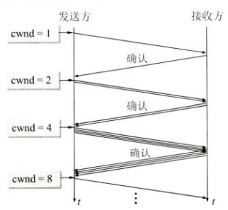

# 5、传输层

作者：Hongtauo

GitHub主页：[Hongtauo · GitHub](https://github.com/Hongtauo)

参考书目：《计算机网络（第八版）》作者：谢希仁

说明：本博客是本人学习过程中对于课程内容的总结与理解，部分章节有引用的部分已经在各章节开头处标明，仅作学习使用，后续更新会结合考研408关于计网的内容

---

引用说明：

[1] [计算机网络中的定时器 - Halo辉Go - 博客园 (cnblogs.com)](https://www.cnblogs.com/Halo-zyh-Go/p/12825232.html)

协议是水平的，服务是垂直的，运输层充当的是应用进程之间的逻辑通信，简单来看，传输层接收来自应用层的报文，然后运输层“好像”水平的传输给了对方的传输层，实际上这两个运输层之间并没有一条水平方向的物理连接，传输的数据要向下交付，最终以某种信号在物理链路上传输，传输层屏蔽了这些的实现细节，使高层的应用看起来好像就是传输层实体之间搭建了一条逻辑信道。

---

# 运输层概念

运输层介于网络层和应用层之间，向上提供通信服务，属于面向通信的最高层，但同时也是用户功能的最低层，处在网络边缘的两台主机使用网络核心部分的功能进行端到端通信的时候，都要使用协议栈中的运输层，而网络核心部分的路由器在转发分组时只用到下三层的功能

## 进程之间的通信

* 网络层

  网络层为主机之间的通信提供服务，通过目的IP地址即可向目的主机发送数据，但是发送过去的数据仍然处在网络层
* 传输层

  传输层在网络层的基础上，为应用程序之间的通信提供服务，通信的两端应该是两个应用进程

  * 传输层提供应用间的通信服务
  * 传输层还要对接收到的报文提供差错检测
  * 根据应用的不同需要，传输层还应该有两种传输协议

    * 面向连接的TCP

      实现可靠传输，相当于一条全双工的可靠信道，特点如下：

      1. 提供面向连接的服务
      2. 数据传输之前必须要建立连接，数据传输结束后要释放连接
      3. 不提供广播和多播服务
      4. 实现开销大，占用资源多

    * 无连接的UDP

      不可靠信道

      1. 传输数据之前不需要建立连接
      2. 提供不可靠交付
      3. 简单，开销小
    * 流控制传输协议SCTP
  * 运输层还应该要屏蔽运输层以下的网络核心细节

## 端口

### 复用与分用

传输层实现了复用和分用的功能

1. 复用

    应用层所有的应用程序都可以通过**传输层**再传送到网络层

    （多用一）
2. 分用

    运输层从IP收到发送给各应用进程的数据后，必须分别交付指明的各应用程序

    （一转多）

### 协议端口

那么现在的问题就是，解决如何将对应的数据交付给对应的进程，学习过操作系统后我们知道，应用是有多种状态的，异步性使得进程是“不可预知的”，所以我们不能像网络层中指明目的主机IP地址那样，指明接收机的某个进程，所以我们设置了“端口”，端口是通信的抽象终点

当应用层要发送数据的时候，应用程序就将数据发送到合适的端口，然后运输层从该端口读取数据

当运输层收到对方主机发来的数据之后，就将数据发送到合适的端口，应用程序就从这些端口读取数据

运输层的端口分为

* 服务器使用的端口号

  因为服务器的端口号必须得是固定的，如果是动态的会造成很多麻烦，导致互联网上的其他应用就无法与他进行通信，如上图所示
* 客户端使用的端口号

  客户端的端口号就是客户进程运行的时候才动态选择的，也叫做短暂端口号，建立通信的时候，由客户端程序发起，当服务器进程收到客户进程的报文的时候，就知道了客户进程的端口号，才能和客户进程进行通信，通信结束后，客户进程释放端口，系统回收端口，然后分配给下一个需要使用的进程

# UDP

UDP叫做用户数据报协议

## 概述

​​

UDP是无连接的，不可靠的传输，他只是再IP数据服务上增加了一点内容——分用和复用以及差错检测

* 无连接的
* 尽最大努力交付的
* 面向报文的

  UDP将应用层交付下来的报文，直接把整个报文加上UDP首部后送入IP层，接收的时候也是这样，即UDP一次交付一个完整的报文
* 没有拥塞控制
* 支持一对一、一对多、多对一、多对多通信
* 首部开销很小

  首部仅有8个字节

## 首部格式

UDP数据报由两个字段组成：数据字段和首部字段，**首部共8个字节**，由四个字段组成，每个字段占两个字节

首部字段：

每个字段都是两个字节

* 源端口
* 目的端口

  接收方UDP发现收到的报文中的目的端口不正确，则丢弃报文，并由网际控制报文协议ICMP发送“端口不可达”的差错报文给对方

  ​​
* 长度

  UDP数据报的长度
* 校验和

  “伪首部”是为了计算校验和而临时添加到UDP数据报前面的

# TCP

## TCP的特点

1. 面向连接的传输层协议

    TCP把连接作为最基本的抽象
2. **每一条TCP连接只能有两个端点，也就是点对点的连接**

    TCP的端点是什么呢?——**套接字**或**插口**

    也就是将IP地址与端口号进行拼接

    $$
    套接字socket=(IP地址:端口号)
    $$

    每一条TCP连接**唯一的**被通信两端的两个端点（也就是套接字对）所确定

    $$
    TCP连接::=\left\{ socket_1 ,socket_2 \right\}=\left\{ (IP_1:port_1),(IP_2:port_2) \right\}
    $$

    一个IP允许有多个不同的TCP连接，同一个端口号也可以出现在多个不同的TCP连接中
3. TCP提供可靠交付功能
4. TCP提供全双工通信
5. 面向字节流

## 可靠传输的原理是什么

理想的传输条件：

1. 传输信道不产生差错
2. 不管发送方以以多快的速度发送数据，接收方总是来得及处理数据

虽然理想的传输条件不可能被现实中的网络所具备，但是我们可以采取一些传输协议来进行控制，对于出现的错误就重传出错的数据，对于传输的速度进行适当调控以能够使接收方来得及处理数据

### 停止—等待协议

”停止-等待“指的是发送方每发送完一个分组后就停止发送，等待对方的确认，在收到确认后再发送下一个分组

#### 无差错情况

#### 出现差错

​​

**超时重传**：

设计一个超时计时器

* B收到有差错的报文，即丢弃该报文，然后什么都不做，A只要超过了一定的时间没有收到B的确认，就认为刚才发的分组丢失了，然后重传该分组
* B没有收到A发出的报文（可能是传输的过程中报文丢失了），自然B什么都不知道，A自然也不会收到来自B的任何确认，当超过一定时间后，重传该分组

注意：

* 当A发送完一个分组后，需要暂留已发送的分组，等到收到B发送的确认后，才可以将暂存的分组副本删除
* 分组和确认分组都必须要进行编号，这样才能明确哪一个发送出去的分组收到了确认，而哪一个还没有收到确认、
* 超时计时器的设置的重传时间应当比数据在分组传输的平均往返时间更长一些（当然也不能太长，不然的话会影响通信的效率，太短也不行，会造成不必要的重传）

#### 确认丢失和确认迟到

##### 确认丢失

确认丢失指的是，B虽然收到了A的报文，B也将确认收到的报文发送给A，但是在传输的过程中，B的确认报文丢失了，A在超时计时器结束之前还未收到来自A的确认，A就会执行重传操作

此时B需要执行两个步骤：

1. 丢弃这个重复的分组，不向上层交付
2. 向A发送确认

##### 确认迟到

确认迟到指的是，B传输给A的确认报文没有丢失，但是在传输的过程中由于某些原因，导致超时送达，A会收到重复的来自B的确认报文，A直接丢弃重复的报文即可，B仍然会收到重复的来自A的报文（因为超时了，A会重传），同样B也丢弃此报文即可，并重传确认分组（因为重传了说明A没有收到B的确认，B就得再确认一次，不然就陷入了死循环了）

如果A一直收不到来自B的确认报文，则说明通信质量太差，不能够进行通信，停止-等待的信道利用率很低

#### 信道利用率

信道利用率为

$$
U=\frac{T_D}{T_D+RTT+T_A}
$$

* $T_D$为发送分组所需要的时间

  $$
  T_D=\frac{分组长度}{数据率}
  $$
* $T_A$是接收方发送确认分组所需要的时间

  $$
  T_A=\frac{分组长度}{数据率}
  $$
* $RTT$是往返时间

### 连续ARQ协议

​​

连续ARQ协议简单来说就是使用一个窗口，该窗口沿着发送的连续分组向前移动，移动的步长是一个分组，当发送方收到来自接收方的一个确认，就向前滑动一个分组，这样就可以实现连续发送分组

接收方采取累计确认的方式，不必对收到的分组逐个发送确认，而是在收到几个分组后，对按序到达的最后一个分组发送确认即可

* 优点

  * 对**确认丢失**的情况不用重传
  * 实现简单
* 缺点

  * 不能向发送方及时反映接收方正确接收的所有分组信息

## TCP可靠传输的实现

### TCP报文段的首部格式

TCP的报文分为首部和数据两部分，**TCP首部的前20个字节是固定的**，后面有4n个字节是根据需要而增加的选项，所以TCP首部的最短长度为20字节

1. 源端口和目的端口
2. 序号
3. 确认号
4. 数据偏移
5. 保留
6. 紧急
7. 确认

    ACK，只有当ACK字段为1的时候才有效，当ACK为0的时候，确认号无效，TCP规定，在建立连接后的所有传送报，ACK必须置为1
8. 推送
9. 复位
10. 同步
11. 终止
12. 窗口
13. 校验和
14. 紧急指针
15. 选项

### 可靠传输

TCP的通信是全双工通信

#### 以字节为单位的滑动窗口

​​

##### 窗口

发送方的窗口叫做发送窗口，接收方的窗口叫做接收窗口，发送窗口是根据接收窗口而定的，但是发送窗口不总和接收窗口一般大

* 发送窗口

  发送窗口由三个指针所描述

  1. $P_3-P_1$：称为A的发送窗口大小
  2. $P_2-P_1$：称为已发送但未收到确认的部分
  3. $P_3-P_2$：称为允许发送但尚未发送的部分（可用窗口）

  * 当接收到接收方发来的确认后，向前滑动相应的距离，但是**指针P2**的位置不动，可用窗口$P_3-P_2$增大

  * 当A继续发送完可用窗口中剩余的部分后，可用窗口变为0，$P_3-P_2=0$，此时发送窗口已满，A停止发送任何数据，等待B发回的确认

    * 如果A没有收到B的确认，一段时间后需要重传这部分数据
    * 如果A按序收到了落在发送窗口内的确认，A就可以使发送窗口向前滑动，准备发送新的数据

      ​​
* 接收窗口

  接收窗口内的数据是允许接收的，接收窗口采取**累计确认**的方式，只对**按序收到的数据**发送其最高序号给出确认，其发送的**确认号=已按序收到的序号的最高位+1**，也就是期望收到的序号的第一个

##### 缓存

缓存的空间和序号的大小都是有限的，需要循环使用

* 发送缓存

  发送缓存是用来：

  * 暂时存放发送应用程序传送给发送方TCP准备发送的数据
  * TCP已经发出但尚未得到对方确认的数据
* 接收缓存

  接收缓存是用来：

  * 暂存按序到达的，但暂时未被应用程序接收的数据
  * 未按序到达的数据

#### 超时重传时间的选择

TCP不能够确保自己下层的网络层的网络环境到底如何，TCP的超时重传的时间设置就显得很有挑战性，如果时限设置的太低，那么会导致许多不必要的重传，如果时限设置的太高，则使得网络通信的效率变低

##### RTT

RTT是报文的往返时间，也就是从报文发出到接收到对方发来的确认报文的时间，这个时间能够大致反映网络的通信情况

TCP采取了一种自适应的算法，它记录了一个报文段发出的时间，以及收到确认报文的时间，这个时间差就是报文的往返时间RTT，TCP保留了RTT的一个加权平均往返时间RTTs（平滑的往返时间），每当第一次测量到RTT样本的时候，RTTs值就取为所测量到的RTT样本的值，以后每测量到一个新的RTT样本，就按照下式进行计算：

$$
新的RTT_s=(1-α)*(旧的RTT_s)+α*(新的RTT样本)
$$

* $0≤α≤1$
* α接近于0，表示新的RTTs的值和旧的RTTs的值相比变化不大，而且对新的RTT样本的影响不大（RTT更新较慢）
* α接近于1，表示新的RTTs的值受新的RTT样本的影响较大（RTT更新较快）
* 目前规定α取1/8

##### RTO

超时计时器设置的重传时间RTO应该要大于上面的RTTs

$$
RTO=RTT_s+4*RTT_D
$$

这里的$RTT_D$是RTT的偏差的加权平均值

$$
新的RTT_D=(1-β)*(旧的RTT_D)+β*|RTT_s-新的RTT样本|
$$

这里的β是小于1的系数，推荐值为1/4 

##### 超时重传的具体实现

假设这样一种情况，主机A向主机B发送了一段数据，等待主机B发送的确认，但是主机A迟迟没有等到主机B发来的确认报文（超过了设置的重传时间），所以主机A就将该数据报文再次发送给主机B，一段时间后，主机A收到了来自B的确认报文，那么问题来了，该如何判断这个报文是对先发送的数据的确认还是对重传的报文的确认？

* Karn算法

  在计算加权平均时间RTTs的时候，只要报文重传了，就不采用其往返样本时间，这样得出的加权平均RTTs和RTO就比较准确
* 修正的Karn算法

  报文段每重传一次，就把超时重传时间RTO增大一些，当不再发生报文段的重传时，才根据$RTO=RTT_s+4*RTT_D$计算超时重传时间

总之，Karn能够使运输层区分开有效的和无效的往返时间样本，对往返时间进行合理估计

#### 选择确认SACK

选择确认的任务就是，对于没有按序到达的缺失的数据，进行重传，而不是重传整个数据序列

如果使用SACK的话，需要在TCP建立链接的时候，在TCP首部加上“允许”SACK“的选项

实际情况下大多数的实现还是重传所有未被确认的数据块

### TCP的流量控制

如果发送方把数据发送得过快，可能会造成接受方来不及接收，流量控制就是为了限制发送方的发送速率，让接收方来得及接收，所谓控制速率实际上是通过调整接收方的窗口来实现的，发送方的窗口不能大于接受方的窗口，接收方的主机主动控制接收窗口的大小实现流量控制

* TCP窗口的单位是字节，不是报文段
* ACK必须为1

#### 持续计时器

如果B通过报文告诉A可接受的窗口大小，那么就会造成一种问题，就是B的这个报文在传输的时候可能会丢失，A一直等待B的非零窗口的通知，B一直等待A的数据，造成死锁

TCP为每一个连接设计了一个持续计时器，只要TCP连接的一方收到对方的零窗口通知，就启动持续计时器，若持续计时器设置的时间到期了，就主动发送一个零窗口探测报文段（1字节）给对方，对方收到探测报文后给出现在的窗口值

* 如果窗口仍然为0，那么收到这个报文段的一方就重新设置持续计时器
* 如果窗口不为0，那么死锁的僵局被打破

那么如果这个非零窗口大小的报文在传输的过程中丢失了，怎么办？

**采用超时计时器，A没有收到回应且超过重传计时器设置的时间后，A会重传探测报文**

### TCP的拥塞控制

#### 什么是拥塞控制

拥塞的出现本质上是系统各部分不匹配，简单的增加处理机速率或者增加节点的缓存都是治标不治本，在系统中，当对某一资源的需求超过了该资源所能提供的可用部分

拥塞控制就是防止过多的数据注入到网络中，可以使得网络中的路由器链路不至于过载，拥塞控制所要作的都有一个前提：网络能够承受现有的网络负荷

拥塞控制是一个全局性的过程

* 开环控制

  开环控制就是在设计这个网络的时候事先将发生拥塞的有关因素考虑周到，力求网络在工作时而不产生拥塞
* 闭环控制（基于反馈）

  * 检测网络系统以便检测到拥塞在何时，何处发生
  * 把拥塞发生的信息传送到可采取行动的地方
  * 调整网络系统的运行以解决出现的问题

#### 拥塞控制的算法

拥塞控制是基于窗口实现的

* 发送方维持一个拥塞窗口cwnd的状态变量
* 拥塞窗口取决于网络的拥塞程度，动态调整
* 假定接收方的接收窗口足够大，发送方只需关注自己的发送窗口，让发送窗口等于拥塞窗口即可
* 发送方在超时重传计时器启动的时候就判断网络出现了拥塞

##### 1. 慢开始

慢开始算法的思路是当主机在已经建立的TCP上开始发送数据的时候，由小到大逐渐增大注入到网络中的数据字节，逐渐增大拥塞窗口数值

慢开始的算法如下：

* 设置初始拥塞窗口cwnd的值
* 每收到一个对新报文段的确认，就将拥塞控制窗口+1

可以发现，拥塞窗口的增长是呈倍增长的，慢开始指的是拥塞窗口从一个很小的值开始增长

​​

##### 2. 拥塞避免

由于拥塞窗口的增长是呈倍数增长的，因为拥塞窗口cwnd增长过大引起网络拥塞，还需要设置一个慢开始门限ssthresh，达到门限值就执行拥塞避免算法，使网络不容易出现拥塞

* 当cwnd<ssthresh时，使用上述慢开始算法
* 当cwnd>ssthresh时，使用拥塞避免
* 当cwnd=ssthresh时，使用哪种方法都可以

拥塞避免算法的目的是，每经过一个往返时间RTT，发送方的拥塞窗口cwnd的大小就加1，可以发现，拥塞避免算法的拥塞窗口是线性增长的，是“加法增大”的过程

* 当设置初始的慢开始门限ssthresh
* 当达到门限值的时候，启动拥塞避免
* 当网络中出现拥塞后，调整慢开始门限ssthresh=出现拥塞的cwnd值/2，同时将cwnd调整为1
* 启动慢开始

​​

##### 3. 快重传

快重传算法可以让发送方尽早直到发生了个别报文段的丢失，要求接收方不要等待自己发送数据时才捎带确认，而是要立即发送确认，即使收到了失序的报文段也要立即发出对已收到的报文段的重复确认，以让发送方知道，连续发送的重复确认都到达了发送方，意味着网络没有出现拥塞，于是立即将缺失的报文进行重传

​​

##### 4. 快恢复

快恢复算法指的是，在上述快重传中，发送方收到了接收方对同一个报文的重复确认，为了避免由于报文丢失（而不是堵在路上）而造成发送方迟迟等不到接收方的确认报文而误以为出现拥塞，所以采取快恢复算法

* 当发送方收到对某个报文的重复确认
* 执行快恢复算法，将门限值ssthresh设置为当前拥塞窗口的一半，同时将拥塞窗口调整为门限值的大小
* 然后执行拥塞避免算法，加法增大拥塞窗口

​​

##### 总结

​​

接收方要根据自己的接收能力设置接收窗口rwnd，并把这个值写入TCP首部的窗口字段，发送给发送方，发送方要保证发送窗口一定不能大于接收窗口的值

$$
发送方窗口的上限值=Min[rwnd,cwnd]
$$

### TCP的运输连接管理

#### TCP连接的建立

三次（报文）握手

​​

* CLOSED：在初始时刻，客户机A和服务器B的TCP进程都属于CLOSED关闭状态
* 准备阶段：服务器B与客户机A都需要各自创建传输控制块，准备好后才能进行TCP的建立连接阶段
* 三次（报文）握手开始

  1. 建立连接：此时服务器B处于监听LISTEN状态，随时准备接收客户机的连接请求，客户机主动发起连接

      客户机发送连接请求报文段给服务器，报文中同步位置SYN=1，选择一个初始序号seq=x

      ==注：SYN报文段不携带数据，但是要消耗一个序列号==
  2. 同步阶段：**客户机**发送了连接请求报文后，进入SYN-SENT同步已发送状态，**服务器**收到来自A的报文后，同意建立连接，向A发送确认，进入SYN-RCVD同步收到状态

      服务器收到了来自A的报文，同意连接，将确认报文发送给B，报文中SYN=1，ACK=1，确认号ack=x+1，初始序号seq=y

      ==注：这个报文段不能携带数据，要消耗一个序列号==
  3. ESTABLISHED：客户机接收到了服务器的确认报文，要向B再次发送确认，同时进入ESTABLISHED连接建立状态

      确认报文段中ACK=1，seq=x+1，ack=y+1

      ==注：ACK报文段可以携带数据，如果不携带数据则不消耗序列号，也就是说，如果此时的确认报文没有携带数据，seq=x，下一个携带数据的报文seq才为x+1==

#### TCP连接的释放

四次（报文）握手

保活计时器

TCP是面向连接的协议，运输连接是用来传送TCP报文的，TCP运输连接的建立和释放是必不可少的通信过程，TCP的连接采用客户服务器模式，主动发起连接的叫客户，被动等待连接的叫服务器

## TCP的四种计时器

1. 超时计时器（重传定时器）

    作用：保证可靠性传输

    解决：每发送一个报文段就会启动重传定时器，如果在定时器时间到后还没收到对该报文段的确认，就重传该报文段，并将重传定时器复位。如果在定时器时间内收到确认则撤销该报文段的重传定时器。

2. 持续计时器（坚持定时器）

    作用：主要用来解决零窗口大小通知可能导致的死锁问题。

    死锁问题：如果接收端在向发送端发送了零窗口报文段后不久，接收端的接收缓存有了一定的存储空间，则向发送端发送一个非零窗口大小的报文段，然而这个报文段在传送过程中丢失了，发送端没有收到该报文段，就一直等待接收端发送非零窗口的报文通知，而接收端并不知道报文段丢失，而是一直等待发送端发送数据，这样就会发生死锁问题。

    解决：TCP为每一个连接设置一个坚持定时器（持续计数器）只要TCP连接的一方收到对方的零窗口报文段，就启动坚持定时器。若坚持定时器设置的时间到期，就发送一个零窗口控测报文段。会有以下3种情况

    1、对方收到探测报文段后，给出确认（现窗口值）如果窗口仍为零，则收到这个报文段的一方将坚持定时器值加倍并重启。（坚持定时器最大为60s）

    2、对方接收到探测报文后，给出确认，此时窗口不为零，则跳出死锁

    3、该探测报文发出后，会同时启动 重传定时器，如果重传定时器时间超时，还没收到响应，则重传探测报文。

3. 保活计时器（保活定时器）

    作用：应对TCP连接期间，客户端和服务端长时间无数据传输的情况。

    问题：当建立TCP连接后，若客户端发生故障，则服务器不能再接收客户端发送的数据，而服务端不能永久的等待下去，则需要保活定时器来解决。

    原理：服务端没收一次客户端的数据，就重新设置保活定时器，通常为2小时，如果2小时没有收到客户端的数据，服务端就发送一个探测报文，以后没间隔76秒发送一次，连续发送10次探测报文后仍没有收到客户端的相应，服务器就认为客户端出现故障，终止连接。

4. 时间等待计时器（2MSL定时器）

    2MSL定时器用来计算一个连接处于Time_wait状态的时间，通常为2MSL（报文段寿命的两倍）。作用：在TCP释放连接时，确认发送的最后一个ACK报文能够到达对方，并防止之前与本连接有关的由于延迟等原因而导致已失效的报文被误判为有效。

‍

# 作业题

1. 试说明运输层在协议栈的地位和作用，运输层的通信和网络层的通信有什么重要的区别，为什么运输层是必不可少的

    答：

    * 运输层的地位

      介于网络层和应用层之间，向上提供通信服务，属于面向通信的最高层，但同时也是用户功能的最低层，处在网络边缘的两台主机使用网络核心部分的功能进行端到端通信的时候，都要使用协议栈中的运输层
    * 运输层的作用

      * 提供差错检测
      * 提供应用间的通信服务
      * 提供两种不同的传输协议
      * 屏蔽下层的实现细节
    * 运输层的通信和网络层的通信的区别

      * 运输层的通信是面向进程的，而网络层的通信是面向主机的
      * 网络层的通信是不可靠的，尽最大努力交付的，而运输层可以采取协议，实现可靠传输
    * 为什么运输层是必不可少的

      * 运输层向下屏蔽了通信实现的细节，实现进程间的跨主机通信
      * 运输层能够根据应用进程的需求采用不同的传输协议
2. 一个UDP用户数据报的首部十六进制表示为06 32 00 45 00 1C E2 17。试求源端口、目的端口、用户数据报的总长度，数据部分长度。这个用户数据报是从客户发送给服务器还是从服务器发送给客户？使用UDP的这个服务器程序试是什么

    答：

    UDP数据报的首部的构成为：源端口、目的端口、长度、校验和四个字段构成，每个字段占两个字节

    根据定义，上述UDP的数据报构成如下表所示：

    |源端口|目的端口|长度|校验和|
    | --------| ----------| -------| --------|
    |06 32|00 45|00 1C|E2 17|

    由表易得：

    十六进制转二进制：逐位转成四位二进制即可

    * 源端口：06 32 

      00000110 00110010
    * 目的端口：00 45

      00000000 01000101
    * 用户数据报长度：00 1C

      00000000 00011100

      也就是长度为28，28-8=20，也就是数据部分的长度
    * 校验和：E2 17 

      11100010 00010111
3. 假定使用连接ARQ协议，发送窗口大小是3，而序号范围是[0,15]，传输媒体保证**能够按序**收到分组，再某一时刻下，下一个期望收到的序号是5

    1. 在发送方的发送窗口中可能出现的序号组合有哪些

        根据累积确认的要求，接收方只能将按序到达的序列的最大序列号作为其确认值，期望收到的序号应当是这个确认值+1，题目中描述的期望收到的序列号为5，而发送窗口为3，也就是说，按序到达的序列的最大序列号为4

        * 没有丢失

          * 2 3 4
        * 有丢失

          * 3 4 5
          * 4 5 6

          * 5 6 7
    2. 接收方已发送的，但在网络中（即还未到达发送方）的确认分组可能有哪些？说明这些确认分组是用来确认哪些序号的分组

        发送的窗口大小为3，而接收方下一个期望收到的分组是5，说明接收方已经对4进行了确认，且最大序号是4

        而接收方能够对4进行确认，说明至少4是已经发送出去的了，也就是至少窗口已经囊括了4，也就是[2，3，4]，说明接收方已经对1进行了确认，所以还没到达发送方的确认就是 2 3 4，只有当发送方接收到了4的确认报文，才有可能将窗口滑动到[5，6，7]（这样的话期望收到的序号就不是5了）

‍
