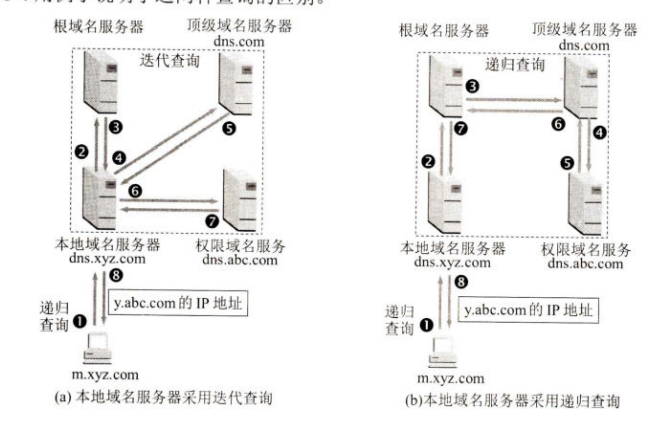

# 6、应用层

作者：Hongtauo

GitHub主页：[Hongtauo · GitHub](https://github.com/Hongtauo)

参考书目：《计算机网络（第八版）》作者：谢希仁

说明：本博客是本人学习过程中对于课程内容的总结与理解，部分章节有引用的部分已经在各章节开头处标明，仅作学习使用，后续更新会结合考研408关于计网的内容

---

应用层的任务是，精确定义一系列的通信规则，向应用程序提供网络接口，直接向用户提供服务

* 应用进程交换的报文类型，如请求报文和响应报文
* 各种报文类型的语法，如报文中各个字段及其详细描述
* 字段的语义，即包含在字段中的信息的含义
* 进程何时、如何发送报文，以及对报文进行响应的规则

应用层的许多协议都是基于**客户服务器模式**，即使是P2P对等通信方式，实质上也是一种特殊的客户服务器模式，客户和服务器是通信中的两个应用进程，客户是服务的请求方，服务器是服务的提供方

# 域名系统

域名系统DNS是负责将便于人们使用的机器名字转换为IP地址的系统，用户与互联网上的某主机进行通信的时候，必须要知道对方的IP地址，然鹅IP地址不容易被人们所理解与记忆，为了在应用层能够便于用户访问对应的网站，连接在互联网上的主机不仅有IP地址，还有主机名，域名DNS系统能够将主机名转换为IP地址，DNS使大多数名字都在本地解析，仅少量的解析需要在互联网上通信，DNS的效率很高，且DNS是分布式系统，即使单个计算机出了故障，也不会妨碍整个DNS系统的正常运行

## 域名结构

现在的互联网采取**层次树状结构**的命名法，每一个域名都由**标号序列组成**，每一个标号之间使用点隔开

* 域名中的标号都由英文字母和数字组成，每一个标号不超过63个字符
* 不区分大小写
* 标号中不能使用除了“-”以外的符号
* **级别最低的域名写在最左边，级别最高的写在最右边**
* 由多个标号组成的完整域名总共不超过255个字符
* 各级域名由其上一级的域名管理机构管理，最高的顶级域名由ICANN进行管理
* 域名只是个逻辑概念，不代表计算机所处的物理地点

## 域名服务器

DNS采取划分区的方法进行管辖，即DNS服务器的管辖范围不是以“域”为单位，而是以“区”为单位，区可以小于或等于域，但一定不能大于域，互联网上的NDS域名服务器也是按层次安排的，每一个域名服务器都只对域名体系中的一部分进行管辖，域名服务器可以分为四种不同的类型：

1. 根域名服务器
2. 顶级域名服务器
3. 权限域名服务器
4. 本地域名服务器

### 根域名服务器

根域名服务器通常不存放域名和IP地址的关系，查询时，根域名服务器会告诉本地域名服务器下一步应该去向哪台顶级域名服务器查询

### 顶级域名服务器

负责管理存放在该顶级域名下注册的所有二级域名

### 权限域名服务器

负责一个区的域名服务器

### 本地域名服务器

## 域名的解析过程

本地DNS缓存-->hosts-->网卡配置信息里的DNS服务器（DNS1,DNS2）-->本地域名服务器执行迭代或递归查询

### 递归查询

主机向本地域名服务器的查询一般都采用递归查询

第一，主机向本地域名服务器的查询一般都采用递归查询(recursivequery)。所谓递归查询就是:如果主机所询问的本地域名服务器不知道被查询域名的地址，那么本地域名服务器就以DNS客户的身份，向其他根域名服务器继续发出查询请求报文〔即替该主机继续查询)，而不是让该主机自己进行下一步的查询。因此，递归查询返回的**查询结果或者是所要查询的IP地址，或者是报错**，表示无法查询到所需的IP地址。

### 迭代查询

**本地域名服务器向根域名服务器的查询通常采用迭代查询**

第二，本地域名服务器向根域名服务器的查询通常采用迭代查询(iterative query)。迭代查询的特点是这样的：当根域名服务器收到本地域名服务器发出的迭代查询请求报文时，要么给出所要查询的IP 地址，要么告诉本地域名服务器：“**你下一步应当向哪一个域名服务器进行查询**”。然后让本地域名服务器进行后续的查询（而不是替本地域名服务器进行后续的查询）。**根域名服务器通常是把自己知道的顶级域名服务器的 IP 地址告诉本地域名服务器**，**让本地域名服务器再向顶级域名服务器查询**。顶级域名服务器在收到本地域名服务器的查询请求后，要么给出所要查询的 IP 地址，要么告诉本地城名服务器下一步应当向哪—-个**权限域名服务器进行查询**，本地域名服务器就这样进行选代查询。最后，知道了所要解析的城名的IP 地址，然后把这个结果返回给发起查询的主机。**当然，本地域名服务器也可以采用递归查询，这取决于最初的查询请求报文的设置要求使用哪一种查询方式。**

# 万维网

## 统一资源定位符URL

格式如下：

$$
协议:// 主机名:端口/路径
$$

# 电子邮件

# 作业题

1. 请说明统一资源定位符URL的作用及一般形式。标注下列URL每部分的含义

    http://www.fosu.edu.cn/en/yxsz/ default.htm

    答：

    统一资源定位符URL的作用是表示从因特网上得到的资源位置和访问这些资源的方法

    URL的一般形式为：<协议>://<主机>:<端口>/<路径>

    http 表示协议；

    [www.fosu.edu.cn](http://www.fosu.edu.cn)表示域名

    /en/ xxx /指向路径

    default.htm文件名
2. 在接入因特网的计算机上，点击鼠标链接到某页面，其URL为：

    [http://www.abc.edu.cn/vn/ff/index.htm](http://www.abc.edu.cn/vn/ff/index.htm)

     请说明在实现此链接时，http/1.0协议的执行步骤。

    (1) 浏览器分析超链指向页面的 URL。

    (2) 浏览器向 DNS 请求解析www.abc.edu.cn 的 IP 地址。

    (3) 域名系统 DNS 解析出www.abc.edu.cn 服务器的 IP 地址。

    (4) **浏览器与服务器建立 TCP 连接**

    (5) 浏览器发出**取文件**命令：

            GET /vn/ff /index.htm。

    (6) 服务器给出响应，把文件 index.htm 发给浏览器。

    (7) TCP 连接释放。

    (8) 浏览器显示文件 index.htm 中的所有文本。
3. 举例说明域名转换的过程，域名服务器的高速缓存的作用是什么

    域名服务器的解析方式有两种：

    1. 第一种叫递归查询，查询过程由解析器向服务器发出递归查询请求，服务器先在所辖区域内进行查找，如果找到，则将结果返回给解析器端；否则向根服务器发出请求，由根服务器从顶向下进行。
    2. 第二种叫迭代查询，解析器每次请求一个名字服务器，当一个名字服务器不能为某个询问提供答案时，由本次请求的服务器返回下次请求服务器的地址，解析器再给另一个名字服务器重新发一个请求。
    3. 域名服务器中的高速缓存的作用：你近期访问过的网址信息存在缓存里，再次访问的时候会从缓存里读取，不需要重新解析。这就加快了域名服务的响应速度
4. 名词解释
