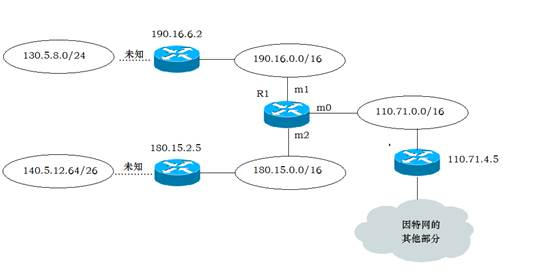

# 作业汇总

作者：Hongtauo

GitHub主页：[Hongtauo · GitHub](https://github.com/Hongtauo)

参考书目：《计算机网络（第八版）》作者：谢希仁

说明：本博客是本人学习过程中对于课程内容的总结与理解，部分章节有引用的部分已经在各章节开头处标明，仅作学习使用，后续更新会结合考研408关于计网的内容

---

# 第三章

1. 数据链路层中链路控制包括哪些功能，试讨论数据链路层做成可靠传输的链路层有哪些优点和缺点

    答：

    数据链路层中的链路控制功能包括:链路管理、帧定界、流量控制、差错控制、将数据和控制信息区分开、透明传输、寻址等功能。

    1. 优点：对于通信质量差的网络，数据链路层协议使用确认和重传机制，数据链路层向上提供可靠传输的服务，可以减少在传输过程中的数据出现的差错，向上层保证链路传输质量。
    2. 缺点：对于通信质量好的网络，采取可靠传输反而会增大数据传输的压力，增加数据传输的时延。
2. PPP协议的主要特点是什么，为什么PPP不使用帧的编号？PPP适用于什么情况？为什么PPP协议不能使数据链路层实现可靠传输？

    答：

    1. 主要特点：

        PPP 协议是用户计算机和 ISP 进行通信时所使用的数据链路层协议。它具有 简单、封装成帧、透明性、多种网络层协议、多种类型链路、差错检测、检测连 接状态、最大传送单元、网络层地址协商以及数据压缩协商等功能。
    2. 在TCP/IP协议簇中，可靠传输由TCP完成，因此数据链路层中的PPP协议不需要进行纠错，故不需要设置序号，也不需要进行流量控制
    3. PPP适用于点到点的传输
    4. 因为PPP协议采用循环冗余校验码能实现检测出错误，PPP能够保证收到的帧是无差错的（即丢弃有差错的报文），但是不能够保证将数据上交到网络层后在网络层的传输不会出现丢失、出错、拥塞等情况，即在数据链路层进行可靠传输不能保证网络层的传输是可靠的，不仅没有必要，而且还会造成性能浪费。此外，现代网络的信道环境较好，在数据链路层出现差错的概率不大时，使用比较简单的PPP协议较为合理，可靠传输可以由高层采用相应的协议实现。
3. 以太网使用的CSMA/CD协议是以争用方式接入到共享信道的，这与传统的时分复用TDM相比有何优缺点

    * CSMA/CD是一种动态媒体接入共享信道的方式：

      1. 优点：所有用户可以随机发送消息，不需要分配固定信道给用户，信道灵活、利用率更高。
      2. 缺点：当网络负荷重的时候，信道争用的方式容易发生碰撞，碰撞之后需要停止发送等待一段时间再发送，会降低信道利用率。
    * 传统时分复用TDM的方法是静态信道划分：

      1. 优点：用户只要分配到了信道就不会和其他用户发生冲突。
      2. 缺点：为用户按**时隙**固定分配信道，在网络负荷较轻的时候，大多数用户没有数据要传送时，用户仍然占用时隙，会导致信道利用率不高，同时TDM是一种静态的信道划分方式，不够灵活，无法动态的调整用户的信道分配。
4. 假定1km长的CSMA/CD网络数据率为1Gbit/s，设信号在网络上传播的速率是200000km/s，求能够使用此协议的最短帧长

    * $$
      端到端最大传播时延=\frac{距离}{传播速度}=\frac{1km}{20000km/s}=5μs
      $$

      端到端的最大传播时延必须小于争用期的一半，故：

      $$
      端到端的最大传播时延=\frac{争用期}{2}
      $$

      所以，端到端的最大传播时延是 5μs，则争用期为10μs
    * $$
      最短帧长=数据率*争用期=1Gbit/s*10μs=10000bit=1250B
      $$

      故最短帧长为1250B

# 第四章

1. 试说明IP地址与MAC地址的区别，为什么要使用这两种不同的地址

    答：

    IP地址是逻辑地址，MAC是物理地址，IP地址解决了跨网络的数据传输问题，而MAC地址只是在同一网络下实现数据传输，网络层屏蔽了网络层以下的数据传输问题，使得不同网络的主机传输数据的过程中就好像是在同一网络中传输数据一样
2. 一个数据报长度为4000字节（**固定首部长度**）,现经过一个网络传送，但此网络能够传送的最大数据长度为1500字节，试问应当划分为几个短些的数据报片？各数据报片的数据字段长度、片偏移字段和MF标志应该为何数值

    答：

    此网络最大能够传输的数据长度为1500字节，那么相对应的，每个数据报不能超过1500字节，即固定首部+数据部分=1500字节

    此数据报数据部分长度为4000字节，对其进行划分，即

    $$
    \frac{4000}{1480}\approx2...1040
    $$

    也就是需要分为三个片，每个片数据字段长度为1480，**片偏移**的计算公式为

    $$
    片偏移=\frac{该片第一个字节在原分组的相对位置}{8}
    $$

    |分片|数据字段长度|片偏移字段|MF标志|
    | ------| --------------| ------------| --------|
    |1|1480|0|1|
    |2|1480|1480/8=185|1|
    |3|1040|2960/8=370|0|
3. 已知路由器R1的转发表如下所示，试画出各网络和必要的路由器之间的拓扑连接，标注出必要的IP地址和接口，对不能确定的情况要进行指明

    路由器R1的路由表

    |地址掩码|目的网络地址|下一跳地址|路由器接口|
    | ----------| --------------| ------------| ------------|
    |/26|140.5.12.64|180.15.2.5|m2|
    |/24|130.5.8.0|190.16.6.2|m1|
    |/16|110.71.0.0|……|m0|
    |/16|180.15.0.0|……|m2|
    |/16|190.16.0.0|……|m1|
    |默认|默认|110.71.4.5|m0|

    

    路由器连接的是不同网段的网络，路由器的每一个端口的IP应当属于所连接网络的网段

    如上，路由器的转发表所示，路由器R1的三个端口分别连接了三个不同网段的网络

    R1 m0 -> 110.71.0.0/16

    R1 m1 -> 190.16.0.0/16

    R1 m2 -> 180.15.0.0/16

    而R1的下一跳路由器都是与R1通过这三个网络相连的，根据下一跳路由器我们可以了解到，总共由三个路由器与R1通过三个不同的网络相连

    R1 m0 -> 110.71.0.0/16 <-110.71.4.5 路由器 未知IP->其他网络

    R1 m1 -> 190.16.0.0/16 <-190.16.6.2 路由器 ····未知····>>目的网络130.5.8.0/24

    R1 m2 -> 180.15.0.0/16 <-180.15.2.5 路由器 ····未知····>>目的网络140.5.12.64/26

    所以，可以画出上图的网络拓扑图，尽管R1知道通过下一跳可以到达目的网络130.5.8.0/24，但是具体的转发R1不需要知道，R1只需要知道自己将数据交付给R1的下一跳路由器即可
4. 某单位分配到一个地址块136.23.16.64/26，现在需要进行进一步划分为4个一样大的子网，试问

    1. 每一个子网中有多少地址

        每一个子网中网络号位28位，所以主机号应该只有32-28=4位

        所以，每一个子网中有$2^4=16$个地址，可用地址数应该是16-2=14个（这里没问可用的，所以答16就可以）
    2. 每个子网的网络前缀有多长

        答：28

        过程：

        这里采用无分址的方法表示，前26位为网络号，后32-26=8位表示主机号，在此基础上，需要再划分出四个子网

        * 4个子网可以用$2^2=4$，即两位二进制数表示，所以向主机号借高2位即可完成四个子网的划分
        * 所以每个子网的前缀长度应该是28
    3. 每一个子网的地址块是什么

        对于某单位分配到的地址块：136.23.16.64/26

        136.23.16.01  000000/26，分配四个子网后

        * 136.23.16.0100  0000/28 ——》136.23.16.0100  1111/28

          转换一下也就是

          136.23.16.64 ~ 136.23.16.79
        * 136.23.16.0101  0000/28 ——》136.23.16.0101  1111/28

          转换一下也就是

          136.23.16.80 ~ 136.23.16.95
        * 136.23.16.0110  0000/28 ——》136.23.16.0110  1111/28

          转换一下也就是

          136.23.16.96 ~ 136.23.16.111
        * 136.23.16.0111  0000/28 ——》136.23.16.0111  1111/28

          转换一下也就是

          136.23.16.112 ~ 136.23.16.127
    4. 每一个子网可分配给主机的最小地址和最大地址是什么

        主机号中，可分配的地址不包括全0和全1的地址，所以去掉这两个地址后

        * 136.23.16.65 ~ 136.23.16.78
        * 136.23.16.81 ~ 136.23.16.94
        * 136.23.16.97 ~ 136.23.16.110
        * 136.23.16.113 ~ 136.23.16.126
5. 试简述RIP，OSPF，BGP路由器选择协议的主要特点

    |特点|RIP|OSPF|BGP|
    | ------------| ------------------------| --------------| -------------------------------------------------|
    |类型|内部网关协议|内部网关协议|外部网关协议|
    |作用范围|小范围网络|自治系统内|自治系统间|
    |更新方法|仅和相邻路由交换信息 |洪泛法|只发送更新的路由|
    |采取的算法|距离向量|链路状态协议|本地偏好、AS跳数最少、热土豆算法，BGP标识符最小|
    |报文封装|UDP|IP|TCP|
6. 假定网络中的路由器B的路由表有如下的项目

    |目的网络|距离|下一跳|
    | ----------| ------| --------|
    |N1|7|A|
    |N2|2|C|
    |N6|8|F|
    |N8|4|E|
    |N9|4|F|

    现在B收到从C发来的路由信息

    |目的网络|距离|
    | ----------| ------|
    |N2|4|
    |N3|8|
    |N6|4|
    |N8|3|
    |N9|5|

    求出B更新后的路由表

    1. B对C发来的路由表项进行更新，修改下一跳为”C“，距离+1

        |目的网络|距离|下一跳|
        | ----------| ------| --------|
        |N2|5|C|
        |N3|9|C|
        |N6|5|C|
        |N8|4|C|
        |N9|6|C|
    2. B对修改后的表和自己的路由表对比

        1. 将新增的目的网络添加

            |目的网络|距离|下一跳|
            | ----------| ------| --------|
            |N1|7|A|
            |N2|2|C|
            |**==N3==**|9|C|
            |N6|8|F|
            |N8|4|E|
            |N9|4|F|
        2. 对相同的目的网络进行比较

            1. 若下一跳相同，更新距离信息

                |目的网络|距离|下一跳|
                | ----------| ------| --------|
                |N1|7|A|
                |N2|<u>***5***</u>|C|
                |**==N3==**|9|C|
                |N6|8|F|
                |N8|4|E|
                |N9|4|F|
            2. 若下一跳不同，更新距离与下一跳信息

                （原表和发来的修改后的表中，目的网络相同但下一跳不同的，比较距离，若距离相同或比原来的还大的则的不更新）

                |目的网络|距离|下一跳|
                | ----------| ------| --------|
                |N1|7|A|
                |N2|<u>***5***</u>|C|
                |**==N3==**|9|C|
                |N6|*<u>**5**</u>*|*<u>**C**</u>*|
                |N8|4|E|
                |N9|4|F|
    3. 结果

        答：

        |目的网络|距离|下一跳|
        | ----------| ------| --------|
        |N1|7|A|
        |N2|<u>***5***</u>|C|
        |**==N3==**|9|C|
        |N6|*<u>**5**</u>*|*<u>**C**</u>*|
        |N8|4|E|
        |N9|4|F|

# 第五章

1. 试说明运输层在协议栈的地位和作用，运输层的通信和网络层的通信有什么重要的区别，为什么运输层是必不可少的

    答：

    * 运输层的地位

      介于网络层和应用层之间，向上提供通信服务，属于面向通信的最高层，但同时也是用户功能的最低层，处在网络边缘的两台主机使用网络核心部分的功能进行端到端通信的时候，都要使用协议栈中的运输层
    * 运输层的作用

      * 提供差错检测
      * 提供应用间的通信服务
      * 提供两种不同的传输协议
      * 屏蔽下层的实现细节
    * 运输层的通信和网络层的通信的区别

      * 运输层的通信是面向进程的，而网络层的通信是面向主机的
      * 网络层的通信是不可靠的，尽最大努力交付的，而运输层可以采取协议，实现可靠传输
    * 为什么运输层是必不可少的

      * 运输层向下屏蔽了通信实现的细节，实现进程间的跨主机通信
      * 运输层能够根据应用进程的需求采用不同的传输协议
2. 一个UDP用户数据报的首部十六进制表示为06 32 00 45 00 1C E2 17。试求源端口、目的端口、用户数据报的总长度，数据部分长度。这个用户数据报是从客户发送给服务器还是从服务器发送给客户？使用UDP的这个服务器程序试是什么

    答：

    UDP数据报的首部的构成为：源端口、目的端口、长度、校验和四个字段构成，每个字段占两个字节

    根据定义，上述UDP的数据报构成如下表所示：

    |源端口|目的端口|长度|校验和|
    | --------| ----------| -------| --------|
    |06 32|00 45|00 1C|E2 17|

    由表易得：

    十六进制转二进制：逐位转成四位二进制即可

    * 源端口：06 32

      00000110 00110010
    * 目的端口：00 45

      00000000 01000101
    * 用户数据报长度：00 1C

      00000000 00011100

      也就是长度为28，28-8=20，也就是数据部分的长度
    * 校验和：E2 17

      11100010 00010111
3. 假定使用连接ARQ协议，发送窗口大小是3，而序号范围是[0,15]，传输媒体保证**能够按序**收到分组，再某一时刻下，下一个期望收到的序号是5

    1. 在发送方的发送窗口中可能出现的序号组合有哪些

        根据累积确认的要求，接收方只能将按序到达的序列的最大序列号作为其确认值，期望收到的序号应当是这个确认值+1，题目中描述的期望收到的序列号为5，而发送窗口为3，也就是说，按序到达的序列的最大序列号为4

        * 没有丢失

          * 2 3 4
        * 有丢失

          * 3 4 5
          * 4 5 6

          * 5 6 7
    2. 接收方已发送的，但在网络中（即还未到达发送方）的确认分组可能有哪些？说明这些确认分组是用来确认哪些序号的分组

        发送的窗口大小为3，而接收方下一个期望收到的分组是5，说明接收方已经对4进行了确认，且最大序号是4

        而接收方能够对4进行确认，说明至少4是已经发送出去的了，也就是至少窗口已经囊括了4，也就是[2，3，4]，说明接收方已经对1进行了确认，所以还没到达发送方的确认就是 2 3 4，只有当发送方接收到了4的确认报文，才有可能将窗口滑动到[5，6，7]（这样的话期望收到的序号就不是5了）

# 第六章

1. 请说明统一资源定位符URL的作用及一般形式。标注下列URL每部分的含义

    http://www.fosu.edu.cn/en/yxsz/ default.htm

    答：

    统一资源定位符URL的作用是表示从因特网上得到的资源位置和访问这些资源的方法

    URL的一般形式为：<协议>://<主机>:<端口>/<路径>

    http 表示协议；

    [www.fosu.edu.cn](http://www.fosu.edu.cn)表示域名

    /en/ xxx /指向路径

    default.htm文件名
2. 在接入因特网的计算机上，点击鼠标链接到某页面，其URL为：

    [http://www.abc.edu.cn/vn/ff/index.htm](http://www.abc.edu.cn/vn/ff/index.htm)

    请说明在实现此链接时，http/1.0协议的执行步骤。

    (1) 浏览器分析超链指向页面的 URL。

    (2) 浏览器向 DNS 请求解析www.abc.edu.cn 的 IP 地址。

    (3) 域名系统 DNS 解析出www.abc.edu.cn 服务器的 IP 地址。

    (4) 浏览器与服务器建立 TCP 连接

    (5) 浏览器发出取文件命令：

    GET /vn/ff /index.htm。

    (6) 服务器给出响应，把文件 index.htm 发给浏览器。

    (7) TCP 连接释放。

    (8) 浏览器显示文件 index.htm 中的所有文本。
3. 举例说明域名转换的过程，域名服务器的高速缓存的作用是什么

    域名服务器的解析方式有两种：

    1. 第一种叫递归查询，查询过程由解析器向服务器发出递归查询请求，服务器先在所辖区域内进行查找，如果找到，则将结果返回给解析器端；否则向根服务器发出请求，由根服务器从顶向下进行。
    2. 第二种叫迭代查询，解析器每次请求一个名字服务器，当一个名字服务器不能为某个询问提供答案时，由本次请求的服务器返回下次请求服务器的地址，解析器再给另一个名字服务器重新发一个请求。
    3. 域名服务器中的高速缓存的作用：你近期访问过的网址信息存在缓存里，再次访问的时候会从缓存里读取，不需要重新解析。这就加快了域名服务的响应速度

‍
