# 第一章 概述

# 计算机网络在信息时代中的作用

略

# 互联网概述

略

# 互联网的组成

互联网的拓扑结构非常复杂，并且在地理上覆盖了全球，，从工作方式来看覆盖了如下两大块：

* 边缘部分
* 核心部分

---

## 互联网的边缘部分

在互联网边缘的端系统之间的通信方式可以分为

* 客户-服务器方式（C/S方式）
* 对等方式（P2P方式）

### 客户-服务器方式（C/S方式）

客户是服务请求方，服务器是服务提供方

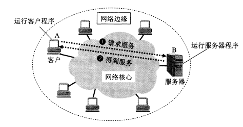

* 客户程序

  * 被用户调用后运行，在通信时主动向远地服务器发起通信请求，因此客户程序必须知道服务器的地址
  * 不需要特殊硬件和复杂的操作系统
* 服务器程序

  * 是一种专门用来提供某种服务的程序，可以同时处理多个远地或本地客户的请求
  * 系统启动后即自动调用并一直不断地运行着，被动地等待并接受来自各地的客户的通信请求，因此服务器程序不需要知道客户的地址
  * 一般需要有强大的硬件和高级的操作系统支持

### 对等连接方式（P2P方式）

对等连接也叫 peer-to-peer，谐音简写为P2P，双方都通过对等连接软件进行平等的、对等的连接和通信。

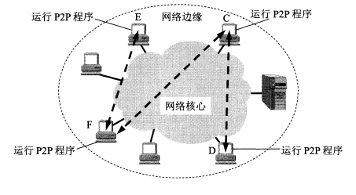

## 互联网的核心部分

网络核心部分是互联网中最复杂的部分，因为网络中的核心部分要向网络边缘中的大量主机提供连通性，使得边缘部分中的任何一台主机都能向其他主机通信。在网络核心中起到特殊作用的是路由器，路由器是一种专用计算机，是实现分组交换的关键构建，其任务是转发收到的分组。

### 电路交换的特点

两部电话之间可以通过一条线路连接起来，如果有N台电话则需要$\frac{N(N-1)}{2}$对电话线路，如果电话数量过于庞大，这种连接方式异常繁琐，而通过交换机，将所有电话都连接到交换S机上，可以让用户之间方便的进行通信，当电话机数量增多的时候，就可以将交换机之间彼此连接起来，完成全网的交换任务，构成覆盖全世界的电信网。

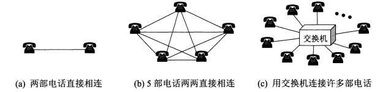

电路交换的一个重要特点就是，在通话的全部时间内，通话的两个用户始终占用端到端的通信资源。

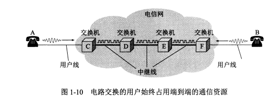

### 分组交换的特点

分组交换采用存储转发技术，对于要发送的整块数据称为一个报文，在发送前将较长的报文划分成一个个更小的等长数据段，每个数据段前面有必要的控制信息组成的首部，首部+数据段构成了一个分组，也称为“包”，分组的首部也可以叫做“包头”。

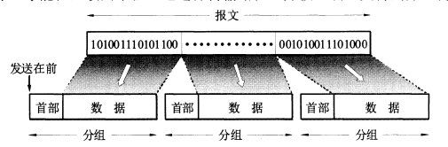

位于网络边缘的主机和位于网络核心部分的路由器都是计算机，但是主机是为用户进行信息处理的，并且可以和其他主机通过网络交换信息，路由器是用来转发分组的，即进行分组交换的。

### 三种交换方式在数据传送阶段的主要特点

* 电路交换：整个报文的比特流连续的从源点直达终点，好像在一个管道中传输
* 报文交换，整个报文先传送到相邻结点，全部存储下来后查找转发表，再转发到下一个结点
* 分组交换，单个分组传送到相邻结点，存储下来后查找转发表，转发到下一结点

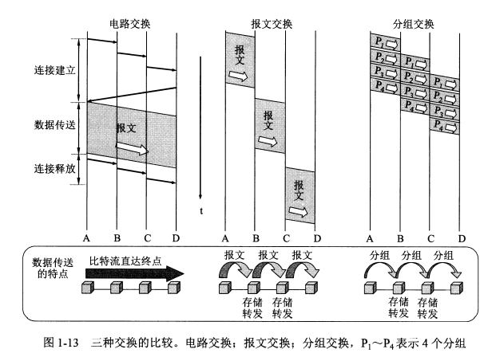

# 计算机网络在我国的发展

# 计算机网络的类别

## 按照网络的作用范围进行分类

### 广域网

广域网的作用范围广，又称为远程网

### 城域网

城域网的作用范围一般是一个城市，可越几个区甚至整个城市，其作用距离约为5~50km城域网可以为一个或几个单位所拥有，但也可以是一种公用设施，用来将多个局域网进行互连。目前很多城域网采用的是以太网技术，因此有时也常并入局域网的范围进行讨论。

### 局域网

一般用微型计算机或工作站通过高速通信线路相连(速率通常在 10 Mbit/s 以上)，但地理上则局限在较小的范围(如 1 km左右)。在局域网发展的初期，一个学校或工厂往往只拥有一个局域网，但现在局域网已非常广泛地使用，学校或企业大都拥有许多个互连的局域网 (这样的网络常称为校园网或企业网)

### 个人区域网

个人区域网就是在个人工作的地方把个人使用的电子设备(如便携式电脑等)用无线技术连接起来的网络，因此也常称为无线个人区域网 WPAN(Wireless PAN)，其范围很小

## 按照网络使用者进行分类

### 公用网

公用网(public network)“公用”的意思就是所有愿意按电信公司的规定交纳费用的人都可以使用这种网络。因此公用网也可称为公众网。

### 专用网

这是某个部门为满足本单位的特殊业务工作的需要而建造的网络。这种网络不向本单位以外的人提供服务。例如，军队、铁路、银行、电力等系统均有本系统的专用网。

## 用来把用户接入到互联网的网络

这种网络就是接入网 AN (Access Network)，它又称为本地接入网或居民接入网。这是类比较特殊的计算机网络。

# 计算机网络的性能

## 性能指标

### 速率

网络技术中的速率指的是数据的传送速率，也成为数据率或者比特率

### 带宽

#### 信号具有的频带宽度

某信道允许通过的信号频带范围就称为该信道的带宽

#### 表示某通道传送数据的能力

网络中某通道传送数据的能力，单位时间内网络中某信道所能通过的“最高数据率”

### 吞吐量

单位时间内通过某个网络（信道、接口）的实际数据量

### 时延

数据从网络一端传送到另一端所需要的时间

$$
总时延=发送时延+传播时延+处理时延+排队时延
$$

#### 发送时延

发送时延指的是主机或者路由器发送数据帧所需要的时间，也就是从发送数据帧的第一个比特算起，到该帧最后一个比特发送完毕所需要的时间。

$$
发送时延=\frac{数据帧长度（bit）}{发送速率（bit/s）}
$$

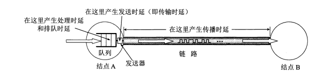

#### 传播时延

传播时延指的是电磁波在信道中传播一定距离需要花费的时间

$$
传播时延=\frac{信道长度（m）}{电磁波在信道上的传播速率（m/s）}
$$

#### 处理时延

主机或路由器在收到分组时要花费一定的时间进行处理，例如分析分组的首部、从分组中提取数据部分、进行差错检验或查找适当的路由等，这就产生了处理时延。

#### 排队时延

分组在经过网络传输时，要经过许多路由器。但分组在进入路由器后要先在输入队列中排队等待处理。在路由器确定了转发接口后，还要在输出队列中排队等待转发。这就产生了排队时延。排队时延的长短往往取决于网络当时的通信量。当网络的通信量很大时会发生队列溢出，使分组丢失，这相当于排队时延为无穷大。

### 时延带宽积(以比特为单位的链路长度)

$$
时延带宽积=传播时延×带宽
$$

例题：设某段链路的传播时延为20ms，带宽为10Mbit/s

$$
时延带宽积=20*10^{-3}*10*10^6=2*10^5bit
$$

这意味着当链路中发送的第一个比特到达终点的时候，发送端就已经发送了20万个比特，这二十万个比特都在链路中向前移动，就如同水管中的水一样。

### 往返时间RTT

在计算机网络中，往返时间 RTT(Round-Trip Time)也是一个重要的性能指标。这是因为在许多情况下，互联网上的信息不仅仅单方向传输而是双向交互的。因此，我们有时很需要知道双向交互一次所需的时间。例如，A 向B 发送数据。如果数据长度是 100 MB，发送速率是100Mbit/s，那么

$$
发送时间=\frac{数据长度}{发送速率}=\frac{100*2^{20}*8}{100*10^6}≈8.39s
$$

如果 B 正确收完 100 MB 的数据后，就立即 发送确认。再假定 A 只有在收到B的确认信息后，才能继续向 B 发送数据。显然，这需要等待一个往返时间 RTT(这里假定确认信息很短，可忽略 B 发送确认的时间)。如果 RTT = 2，那可以算出A向B 发送数据的有效数据率。

$$
有效数据率=\frac{数据长度}{发送时间+RRT}=\frac{100*2^{20}*8}{8.39+2}≈80.7Mbit/s
$$

小于一开始A向B发送的数据率

### 利用率

利用率分为信道利用率和网络利用率，信道或网络的利用率过高会产生非常大的时延

​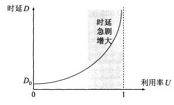​

## 非性能指标

* 费用
* 质量
* 标准化
* 可靠性
* 可拓展性和课升级性
* 易于管理和维护

# 计算机网络体系结构

## 计算机网络体系结构的形成

假设两台连接在网络上的计算机之间要互相传送文件，那么除了物理上两台计算机之间需要有一条传送数据的通路之外，还需要有一些工作需要完成：

* 发起通信的计算机必须将数据通信的通路进行激活(activate)。所谓“激活”就是要发出一些信令，保证要传送的计算机数据能在这条通路上正确发送和接收。
* 要告诉网络如何识别接数据的计算机。
* 发起通信的计算机必须查明对方计算机是否已开机，并且与网络连接正常。
* 发起通信的计算机中的应用程序必须弄清楚，在对方计算机中的文件管理程序是否已做好接收文件和存储文件的准备工作。
* 若计算机的文件格式不兼容，则至少其中一台计算机应完成格式转换功能
* 对出现的各种差错和意外事故，如数据传送错误、重复或丢失，网络中某个结点交换机出现故障等，应当有可靠的措施保证对方计算机最终能够收到正确的文件。

分层的方法可以解决庞大而复杂的问题，转换为若干较小的局部问题

‍

## 协议与层次划分

在计算机网络中要做到有条不紊地交换数据，就必须遵守一些事先约定好的规则。这些规则明确规定了所交换的数据的格式以及有关的同步问题。这里的同步是广义的同步，含有时序的意思，这些为进行网络中的数据交换而建立的规则、标准或约定称为网络协议（简称协议）

### 网络协议

* 语法

  数据与控制信息的结构或格式
* 语义

  需要发出何种控制信息，完成何种动作以及做出何种响应
* 同步

  时间实现的顺序以及详细的说明

### 分层

* 各层之间是相互独立的
* 灵活性好
* 结构上可分割开
* 易于实现和维护
* 能促进标准化工作

  * 差错控制
  * 流量控制
  * 复用和分用
  * 连接建立和释放

### 总结

计算机网络的各层及其协议的集合就是网络的体系结构，计算机网络的体系结构就是这个计算机网络及其构件所应该完成的功能的精确定义，体系结构是抽象的，而实现是具体的，是真正在运行的计算机硬件和软件。

## 具有五层协议的体系结构

综合了OSI的七层协议和TCP/IP的五层协议

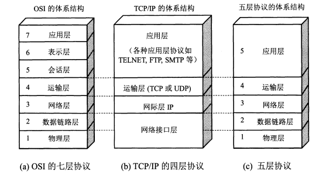

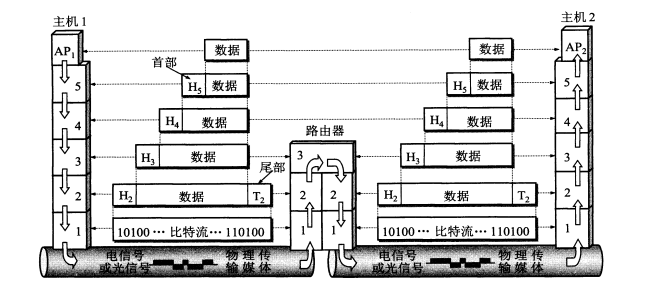

### 应用层

应用层是体系结构中的最高层。应用层的任务是通过应用进程间的交互来完成特定网络应用。应用层协议定义的是应用进程间通信和交互的规则。这里的进程就是指主机中正在运行的程序。对于不同的网络应用需要有不同的应用层协议。在互联网中的应用层协议很多，如域名系统 DNS，支持万维网应用的 HTTP 协议，支持电子邮件的 SMTP 协议，等等。我们把应用层交互的数据单元称为报文(message)。

### 运输层

运输层的任务就是负责向两台主机中进程之间的通信提供通用的数据传输服务。应用进程利用该服务传送应用层报文。所谓“通用的”，是指并不针对某个特定网络应用，而是多种应用可以使用同一个运输层服务。由于一台主机可同时运行多个进程，因此运输层有复用和分用的功能。复用就是多个应用层进程可同时使用下面运输层的服务，分用和复用相反，是运输层把收到的信息分别交付上面应用层中的相应进程。

主要采用两种协议：

* 传输控制协议TCP

  提供面向连接的、可靠的数据传输服务，其数据传输的单位是报文段
* 用户数据报协议UDP

  提供无连接的、尽最大努力的数据传输服务，且不保证数据传输的可靠性，其数据传输的单位是用户数据报

### 网络层

网络层负责为分组交换网上的不同主机提供通信服务。在发送数据时，网络层把运输层产生的报文段或用户数据封装成分组或包进行传送。

### 数据链路层

数据链路层简称为链路层，在两个相邻结点之间传送数据时，数据链路层将网络层交下来的 IP 数据报组装成(raing)，在两个相邻结点间的链路上传送帧(frame)。

每一包括数据和必要的控制信息(如同步信息、地址信息、差错控制等)。

## 物理层

在物理层上传输数据的单位是比特，发送方发送 1(或 0)时，接收方应当收到 1(或0)而不是0(或1)因此物理层要用多的电代表“1”或“0”，以及接方如何识别出发送方所发送的比特。

物理层还要确定连接电缆的插头应当有多少根引脚以及各引脚应如何连接。当然，解释比特代表的意思，就不是物理层的任务。

注意，传递信息所利用的一些物理媒体，如双绞线、同轴电缆、光缆、无线信道等，并不在物理层协议之内而是在物理层协议的下面。

因此也有人把物理层下面的物理媒体当作第0层。

## 实体、协议、服务和服务访问点

计算机网络协议有一个非常重要的特点，就是协议必须把所有不利的条件都事先估计到，而不能假定一切都是正常的和非常理想的。

### 实体

实体表示任何可发送或接受信息的硬件或软件进程

### 协议

协议是控制两个对等实体或多个实体进行通信的规则的集合。协议是“水平的”，即协议是控制对等实体之间通信的规则。

### 服务

在协议的控制下，两个对等实体间的通信使得本层能够向上一层提供服务，要实现本层协议，还需要使用下面一层提供的服务。服务是“垂直的”服务是由下层向上层通过层间接口提供的。只能够被上层实体使用到的下层所提供的功能的才叫服务，上层使用下层提供的服务必须通过下层交换一些命令，这些命令在OSI中称为**服务原语**。

### 服务访问点SAP

服务访问点SAP是在统一系统中相邻两层的实体进行交互（交换信息）的地方。实际上就是一个逻辑接口，但这种层间接口和两个设备之间的硬件接口不同。

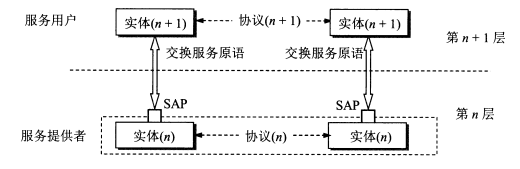​

## TCP/IP的体系结构

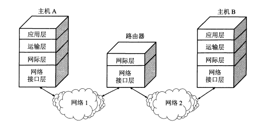

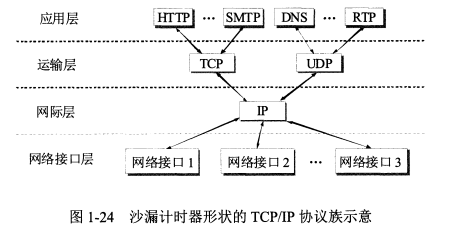

‍
