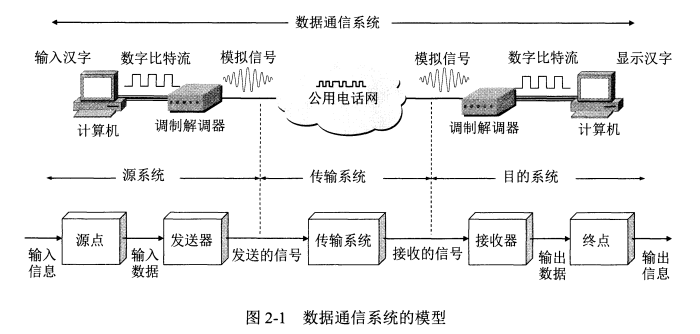

# 第二章 物理层

物理层考虑的是怎么样才能在连接各种计算机的传输媒体上传输比特流，而不是指具体的传输媒体。

---

# 物理层的概念

物理层的作用正是要尽可能地屏蔽掉这些传输媒体和通信手段的差异，使物理层上面的数据链路层感觉不到这些差异，这样就可使数据链路层只需要考虑如何完成本层的协议和服务，而不必考虑网络具体的传输媒体和通信手段是什么。用于物理层的协议也常称为物理层规程(procedure)。其实物理层规程就是物理层协议。只是在“协议”这个名词出现之前人们就先使用了“规程”这一名词。

物理层的主要任务是确定与传输媒体接口有关的一些特性：

* 机械特性
* 电气特性
* 功能特性
* 过程特性

数据在计算机内部一般是并行传输的，但是数据在通信线路中的传输方式一般是串行传输，也就是逐个比特按照时间顺序传输，物理层还需完成传输方式的转换

# 数据通信的基础知识

## 数据通信系统的模型

一个数据通信系统可以划分为三大部分，即源系统，传输系统，目的系统

### 源系统

源系统由三个部分组成：源点、发送器、接收器

#### 源点

源点设备产生要传输的数据，例如，从计算机的键盘输入汉字，计算机产生输出的数字比特流。源点又称为源站，或信源

#### 发送器

通常源点生成的数字比特流要通过发送器编码后才能够在传输系统中进行传输。典型的发送器就是调制器。现在很多计算机使用内置的调制解调器 (包含调制器和解调器)，用户在计算机外面看不见调制解调器

#### 接收器

接收传输系统传送过来的信号，并把它转换为能够被目的设备处理的信息。典型的接收器就是解调器，它把来自传输线路上的模拟信号进行解调，提取出在发送端置入的消息，还原出发送端产生的数字比特流

#### 终点

终点设备从接收器获取传送来的数字比特流，然后把信息输出(例如，把汉字在计算机屏幕上显示出来)。终点又称为目的站，或信宿

### 传输系统

传输网络

### 目的系统

接收端、接收方

‍

## 信号

通信的目的是为了传送消息，语音、文字、图像、视频等的都可以叫做消息

**数据**是运送消息的实体，是使用特定的方式表示的信息，通常是有意义的符号序列，这种信息的表示可以用计算机或者其他机器、人处理产生。

**信号**则是数据的电气或者电磁表现

### 信号的种类

* 模拟信号，或连续信号
* 数字信号，或离散信号

## 信道

信道和电路并不等同，信道一般都是用来表示某一个方向上传送信息的媒体，因此一条通信电路往往包含一条发送信道和一条接收信道

### 信息交互的三种形式

* 单向通信

  也叫做单工通信，只能有一个方向的通信而没有反方向的交互

* 双向交替通信

  也叫做半双工通信，通信的双方都可以发送信息，但不能同时发送与接收信息
* 双向同时通信

  也叫做双全工通信，通信的双方可以同时发送和额接收信息

### 基带信号

来自信源的信号常称为基带信号 (即基本频带信号)，基带信号往往包含有较多的低频成分，甚至有直流成分，而许多信道并不能传输这种低频分量或直流分量，为了解决这一问题，就需要对信号进行调制

## 调制

调制可以分为两大类：基带调制和带通调制

## 信道的极限容量

# 物理层下面的传输媒体

‍
