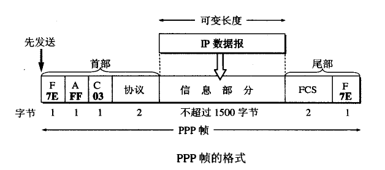
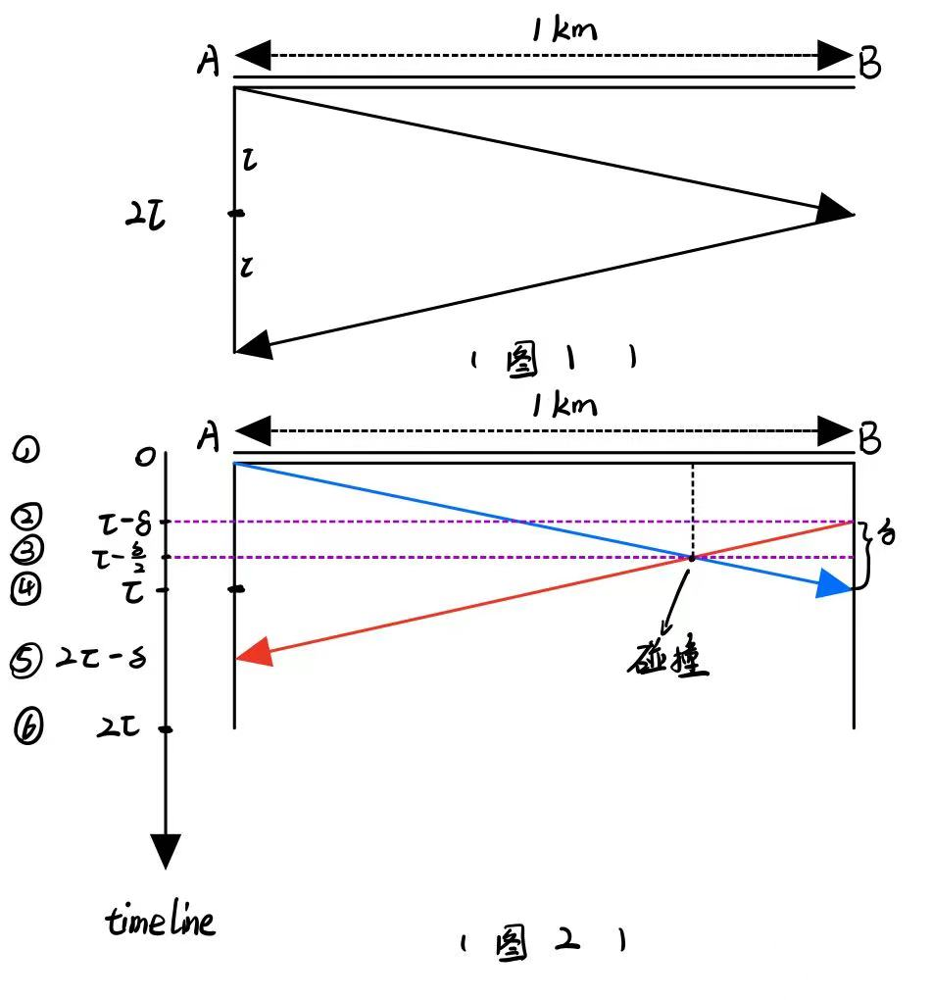

# 计算机网络原理考试纲要

**作者：** Hongtauo
**GitHub** ：https://github.com/Hongtauo/Computer_Network_Fundamentals

考纲：

1. 题型：

    * 选择
    * 填空
    * 名词解释

      * PPP
      * CSMA/CD
      * IPV4
      * IPV6
      * ICMP
      * ARP
      * NAT
      * HTTP/HTTPS
      * HTML
      * DNS
      * URL
    * 大题

      * 3、4、5章作业题
      * 鼠标点击超链接后执行的操作
      * URL的意思
2. 重点章节：

    3\4\5\6 章

---

# 1、概述

* 21世纪最重要的特征是：数字化、网络化、信息化
* 三网合一是指：电信网络、有线电视网络、计算机网络
* 计算机网络的定义：由若干节点和连接这些节点的链路组成
* 互联网：多个网络通过路由器相互连接起来，构成一个覆盖范围更大的网络，因此互联网是”网络的网络“
* 不同类别的计算机网络

  * 按照网络的作用范围分类：

    * 广域网WAN
    * 城域网MAN
    * 局域网LAN
    * 个人区域网PAN
  * 按照网路的使用者进行分类

    * 公用网
    * 专用网
  * 用来把用户接入到互联网的网络

    * 接入网
* 计算机网络的性能指标

  * 速率
  * 带宽
  * 吞吐量
  * 时延
  * 时延带宽积
  * 往返时间RTT
  * 利用率
* 网络的非性能指标

  * 费用
  * 质量
  * 标准化
  * 可靠性
  * 可拓展性和可升级性
  * 易于管理和维护
* 计算机网络的体系结构

  * OSI
  * TCP/IP
  * 五层体系结构

    * 应用层
    * 传输层
    * 网络层
    * 数据链路层
    * 物理层
* 实体、协议、服务和服务访问点

  * 实体

    实体是发送或接收信息的硬件或软件进程
  * 协议

    协议是控制两个对等实体（或多个实体）进行通信的规则的集合

  * 服务

    在协议的控制下，两个对等实体间的通信使得本层能够向上一层提供服务，要实现本层协议，还需要使用下面一层所提供的服务

    * 协议是水平的，服务是垂直的
    * 协议的实现保证了能够向上一层提供服务，使用本层服务的实体只能看见服务而无法看见下面的协议，协议对上面的实体是透明的
  * 服务访问点

    在同一系统中相邻两层的实体进行交互（交换信息）的地方

# 2、物理层

物理层的作用是，能够屏蔽传输媒体与通信手段的差异，使得物理层上面的数据链路层感觉不到这些差异。用于物理层协议也叫做物理层规程

---

## 基本概念

可以将物理层的主要任务描述为确定与传输媒体的接口有关的特性：

* 机械特性

  指明接口所用的接线器的形状和尺寸、引脚数目和排列、固定和锁装置

* 电气特性

  指明在接口电缆的各条线上出现的电压的范围
* 功能特性

  指明某条线上出现的某一电平的电压的意义
* 过程特性

  指明对于不同功能的各种可能事件的出现顺序

## 物理层下面的传输媒体

传输媒体又叫做传输介质或者是传输媒介，是在数据传输系统中在发送器和接收器之间的物理通路。传输媒体可以分为两大类：

1. 引导型传输媒体
2. 非引导型传输媒体

---

### 引导型传输媒体

1. 双绞线
2. 同轴电缆
3. 光缆

### 非引导型传输媒体

1. 无线传输的频段
2. 无线微波通信

## 信道复用技术

### 频分、时分、统计时分复用

1. 频分复用FDM

    顾名思义，频分复用的目标就是对信号传输的频率范围操刀，将不同路的信号进行调制，分别搬到适当的频率位置，使其彼此不会产生干扰，故频分复用的各路信号在同样的时间占用不同的带宽资源

    * 频分多址

      多址强调的是这种复用的信道可以让多个用户接入进来
2. 时分复用TDM

    时分复用就是将时间分成一段段等长的时分复用帧TDM帧，每一路信号在每一个TDM帧中占用固定序号的时隙，每一路信号占用的时隙周期性的出现，其周期为TDM的周期

    * 时分多址

      多址强调的是这种复用的信道可以让多个用户接入进来
3. 统计时分复用STDM（异步时分复用）

    统计时分复用是时分复用的改进，能够明显地提高信道的利用率

    统计时分复用使用STDM帧来传送复用的数据，每一个STDM帧的时隙数小于连接在集中器上的用户数，每个用户随时将自己的数据送入缓存区，然后集中器按顺序依次扫描输入缓存，将缓存中的数据放入STDM帧中，当一个帧的数据满了，就发送出去，所以STDM并不是固定分配时隙，而是按需动态地分配时隙，每一个用户占用的时隙并不是周期出现的。

### 波分复用

### 码分复用

## 数字传输系统

## 宽带接入技术

## 本章节名词解释

# 3、数据链路层（重点）

数据链路层（Data Link Layer）属于计算机网络的低层，其使用的信道分为以下两种类型

1. 点对点信道
2. 广播信道

还是那句话，协议是水平的，服务是垂直的，当我们研究数据链路层的问题时，我们可以只关心所在协议栈水平方向的各数据链路层

集线器、中继器工作在物理层

网桥、交换机工作在数据链路层

---

## 数据链路层的三个基本问题

### 数据链路和帧

#### 链路和数据链路

* 链路（link）：

  链路指的是从下一个节点到相邻节点的物理线路，中间没有任何其他的交换节点

* 数据链路（data link）：

  数据链路指的是，数据在线路上传输的时候，除了需要基本的用于传送数据的物理线路外，还需要使用一些必要的协议来控制数据的传输，故 **数据链路=链路+协议**

#### 帧

帧是数据链路层协议单元，数据链路层把网络层交下来的数据报构成帧发送到链路上，以及把接收到的帧中的数据取出并上交给网络层，在互联网中，网络层协议数据单元就是IP数据报。数据链路层无需考虑物理层如何实现比特传输的细节。

### 三个基本问题

#### 封装成帧

封装成帧就是在数据链路层，对网络层交付下来的IP数据报，在其前后分别添加首部和尾部，以构成帧，这样的帧就是数据链路层传输的基本单元。

* 帧界定

  帧的帧长=首部长度+尾部长度+数据报长度

  首部和尾部的功能就是进行帧界定，能够使得接收方判定传送过来的帧是否完整，便于后续差错控制
* 控制

  首部和尾部还需要包含控制信息，在传输数据时，是从首部开始发送的，各种数据链路层协议都对首部和尾部的格式有明确规定

* 最大传输单元MTU

  * 为了提高帧的传输效率，帧中数据部分的长度应该要尽可能的大于首部和尾部的长度
  * 每一种数据链路层协议都规定了所能传输的帧的数据部分长度上限，称为最大传输单元MTU

#### 透明传输

透明传输的定义是：在数据链路层，无论什么样的比特组合的数据，都能按照原样没有差错地通过这个数据链路层，也就是数据链路层对需要传输的数据而言是透明的，被传输的数据无需关心数据链路层的实现细节

透明传输的实现：

这种方法叫做字节填充或字符填充

* 发送端的数据链路层在数据中出现控制字符“SOH”和“EOT”的前面插入转义字符“ESC”
* 接收端的数据链路层在把数据交付给网络层之前删除这个插入的转义字符
* 如果数据中出现转义字符，解决办法依旧是在其前面插入一个转义字符

#### 差错控制

##### 传输差错

1. 比特差错
2. 帧丢失、帧重复、帧失序

    * 帧丢失

    * 帧重复
    * 帧失序

##### 比特差错控制——循环冗余校验码CRC

算法过程：

* 在带传送的数据M后添加用于比特差错检测的n位冗余码，冗余码可以用模2运算得到
* 在接收端把接收到的数据进行CRC校验

  * 若得出的余数R=0，则判定此帧没有比特差错，应接受此帧
  * 若余数R≠0，则判定此帧出现比特差错（无法判定哪一位出错，也无法进行纠错），应丢弃此帧

在数据链路层仅仅采用CRC只能做到对帧的无比特差错接受，凡是接收端数据链路层接受的帧均无比特差错，但是不代表无传输差错

##### 数据链路层的可靠传输

仅仅使用CRC只能做到无比特差错传输，但是无法做到无差错传输，在过去OSI认为必须要让数据链路层向上提供可靠传输的服务，但是在现代互联网中，通信链路的质量大大提高，故针对不同的链路，可以采取不同的办法。

* 可靠传输的实现

  * CRC循环冗余校验
  * 帧编号、确认、重传
* 现代互联网的数据链路层

  * 针对通信质量良好的**有线传输链路**，数据链路层协议不使用确认重传机制，不要求数据链路层向上提供可靠传输的服务（如果出现了差错，那么就由上层协议进行改错）
  * 对于通信质量较差的**无线传输链路**，数据链路层协议使用确认和重传机制，数据链路层向上提供可靠传输的服务

## 点对点信道特点及其协议

PPP协议也叫点对点协议，是目前使用的最广泛的数据链路层协议

### PPP协议的特点

PPP协议是计算机与ISP（网络业务提供商）进行通信时使用的数据链路层协议

#### PPP协议满足的需求

1. 简单
2. 封装成帧
3. 透明传输
4. 多种网络层协议
5. 多种类型链路
6. 差错检测

    * 在TCP/IP协议簇中，可靠传输由TCP完成，因此数据链路层中的PPP协议不需要进行纠错，故不需要设置序号，也不需要进行流量控制

    * PPP只支持全双工链路
7. 检测连接状态
8. 最大传送单元
9. 网络层地址协商
10. 数据压缩协商

#### PPP协议的组成

1. 将IP数据报封装到串行链路的方法
2. 用来建立、配置和测试数据链路连接的链路控制协议LCP
3. 一套网络控制协议NCP

### PPP协议的帧格式

* 首部和尾部都各有一个标志字段F，标志字段为PPP帧的界定符号，规定为0x7E
* 首部中的A、C字段分别为地址字段和控制字段，实际上这两个字段并没有携带PPP帧的信息
* 首部中的协议字段为两个字节的字段，表示所支持的协议
* 信息部分的字段长度是可变的，不超过1500字节
* 尾部中的FCS字段是使用CRC的帧检验序列FCS

### PPP协议的工作状态

* 无链路状态
* 建立物理链路
* 建立LCP链路
* 网络层配置
* 链路打开

## 广播信道特点及其协议

### CSMA/CD协议

CSMA/CD是载波监听多点接入/碰撞检测，在使用本协议的时候，一个站不可能同时进行发送和接收，所以使用的通信方式为半双工通信（双向交替通信）

#### 多点接入

总线型网络，许多计算机以多点接入的方式连接在一根总线上，协议的实质是“载波监听”和“碰撞检测”

#### 载波监听

载波监听就是不管在想要发送数据之前，还是在发送数据之中，每个站都必须不停地检测信道

#### 碰撞检测

载波监听的任务是不管在想要发送数据之前，还是在发送数据之中，每个站都必须不停地检测信道

* 在发送数据之前进行载波监听

  为了避免冲突，如果检测出已经有其他站点发送的数据，则本站就暂时不要发送数据
* 在发送数据之中进行载波监听

  为了及时发现如果有其他站点也在发送，就立即中断本站的发送，也就是“碰撞检测”

“碰撞检测”是适配器边发送数据边检测信道上的信号电压变化情况，当适配器检测到信道上的电压变化幅度超过了设定的阈值，则认为发生了“碰撞”，也就是存在至少两个站点发出的数据出现了冲突。

##### 冲突发生的原因

虽然每个适配器在发送数据之前都进行了载波监听，但是仍不能避免“碰撞”的发生，因为信号在介质上的传导是有时延的，即信号的传播速度是有限的，很有可能在当前时刻，某台适配器未检测到+ 信道被占用，随即立即将自己的数据发送到信道上，造成了在某一位置，两个数据的“撞车”。

电磁波在1KM电缆上的传播时延是5μs，记作τ

* 图1

  * 在0时刻，A向信道发送数据，在距离A 1km处的B要经过1τ才能监听到信道为“繁忙”，在0~τ这段时间内，B很有可能误判信道为“空闲”而发送数据，造成碰撞。
  * 信号往返总共需要2τ，也就是端到端往返传播时延，这个数值是A知道自己发出的数据是否碰撞的最迟时间。
* 图2

  ① $t=0$，适配器A向信道发送数据，B检测到信道为“空闲”

  ② $t=τ-σ （0<σ<τ）$，此时A发送的数据还没有到达B，B检测到信道为空闲的，故向信道发送数据

  ③ $t=τ -\frac{σ}{2}$ , 此时A和B的数据发生了碰撞，但是A和B都不知道发生了碰撞

  ④ $t = τ$ , 此时B知道发生了碰撞，停止发送数据，A还不知道发生了碰撞

  ⑤ $t=2τ-σ$ , 此时A知道发生了碰撞，因此也停止发送数据

  A，B发送的数据均失效，需要等待一段时间后重新发送

##### 退避算法

每一个站在自己发送数据之后的一小段时间内，存在着遭遇碰撞的可能性，这一小段时间是不确定的，取决于另一个发送数据的站到本站的距离，所以以太网并不能保证在检测到信道空闲后的某一段时间内，一定能够把自己的数据成功发送出去，这个**特性称为发送的不确定性**

* 争用期

  * 以太网的**端到端往返时间**2τ也叫做争用期（碰撞窗口），指的是最先发送数据的站点知道碰撞发生的最迟时间
  * 只有当发送完数据后，能够渡过“碰撞窗口”，才能够说明此次数据顺利发送完毕，即争用期结束后仍没有检测到碰撞，才能肯定这次发送不会发生碰撞
* 截断二进制指数退避

  截断二进制指数退避的任务是，确定碰撞后的重发时机，当碰撞发生后，不是等到信道“空闲”就立即发送，而是退避一个随机的时间

  * 基本的退避时间是2τ，具体的争用期时间是51.2μs
  * 从离散的整数集合$[0,1,...,(2^k-1)]$中随机取出一个数，记作$r$，重传应推后的时间是$r$倍的争用期，参数$k$的计算公式为：

    $$
    k=min[重传次数,10]
    $$

    1. 当重传次数不超过10的时候，k就是重传次数
    2. 当重传次数超过10的时候，k就为10
  * 当重传次数达到16次仍然不成功的时候，则丢弃该帧，向上报告
* 最短帧长

  目的是为了避免发送站发送了一个很短很短的数据，在信道中发生碰撞后，被目的站丢弃，而发送站未来得及检测到碰撞就进入了发送下一帧数据的准备，从而“不知道”要重传此帧

  * 最短帧长64字节，也就是512bit
  * 凡是长度小于64字节的都是由于冲突而异常终止的无效帧

以太网的最大端到端时延τ必须要小于争用期的一半（25.6μs）

**注意：**这里的争用期的定义是在以太网速度为10Mbit/s，端之间距离为 1km 下**定义为51.2μs**，所以根据公式可以计算出在给定数据率下的最短帧长（在计算题直接根据距离/传播速度算即可）

$$
最短帧长=\frac{争用期}{数据率}
$$

> 为什么最短帧的大小取决于争用期时长？因为如果最短帧的传输时间小于争用期（比如30μs），那么就会导致发送完这个帧之后，在不知道帧有没有传送成功的情况下（至少需要51.2μs来确定）又发送了下一个帧。反之，如果最短帧的传输时间大于争用期，由于碰撞信息一定可以在帧发送完之前传到，就可以保证只有在上一个帧没有发生碰撞，正确传输的情况下才会发送下一个帧。
>
> 对于**最大长度为2500米的10Mbps 网络和四个中继器**（来自802.3规范），在最坏的情况下，往返时间（包括通过四个中继器的传播时间）被确定为接近**50微秒**。因此，允许的最短帧必须至少花费这么长的时间来传输。在10Mbps时，一个比特需要100纳秒，所以500比特是保证工作的最小帧。为了增加一些安全边际，这个数字被四舍五入到**512比特即64字节**，相应的，以太网的争用期长度也被确定为**51.2 μs ​**
>
> **据此规定以太网帧长≥ 64 字节，长度小于64字节的帧为无效帧**
>
> 作者：禹名的白给日常  
> 链接：https://www.zhihu.com/question/21882019/answer/1801210673  
> 来源：知乎

* 对于10mbit/s的以太网，其争用期内可以发送$10Mbit/s*51.2μs=512bit$也就是64字节的数据
* 只要最大端到端时延小于最短争用期的一半，也就是25.6μs，最大支持的端到端距离约为5km，所以最小帧长为64字节足够能让发送端检测出碰撞（不可能两台端设备距离大于5km且只用一根线连接）

##### 强化碰撞

* 人为干扰信号

  当发送数据的站一旦发现发生了碰撞时，除了立即停止发送数据外，还要继续发送32比特或者48比特的认为干扰信号，以便让所有用户都知道现在已经发生了碰撞
* 帧间最小间隔

  9.6μs，相当于9.6比特时间，为了能够使刚刚收到的数据帧的站的接收缓存来得及清理

要点归纳：

1. 准备发送：适配器从网络层获得一个分组，加上以太网的首部和尾部，组成以太网帧，，放入网卡的缓存中，但在发送之前，必须先检测信道。
2. 检测信道：不停地检测信道，一直等待信道空闲，并在96比特时间内信道保持空闲（保证了帧间最小时间间隔），就发送这个帧。
3. 在发送过程中仍不停地检测信道，即网络适配器要**边发送边监听**。这里只有两种可能性：

    * 发送成功：如果在争用期内一直未检测到碰撞，则认为发送成功，回到（1）
    * 发送失败：在争用期内检测到碰撞，这是立即停止发送数据，并按规定发送人为干扰信号。适配器接着就执行指数退避算法，等待r倍512比特时间后，返回到步骤（2），继续检测信道。如果重传16次仍不能成功，则停止重传向上报错。
4. 以太网每发送一帧，一定要把已发送的帧暂留，如果在争用期内检测出发生了碰撞，那么还要推迟一段时间后再把这个暂留的帧进行重传

## 以太网的MAC层

在局域网中，硬件地址也叫做物理地址，或者mac地址，mac地址固化在适配器的ROM中，是唯一的

## 拓展的以太网

拓展的以太网在网络层中看依旧是一个网络

### 在物理层拓展以太网

#### 使用光纤进行拓展

* 主机使用光纤（通常是一对光纤）和一对光纤调制解调器连接到集线器。
* 很容易使主机和几公里以外的集线器相连接。

#### 使用集线器进行拓展

使用集线器进行拓展，可以连接成覆盖范围更大的多级星形结构的以太网

* 优点

  * 使原来属于不同碰撞域的以太网上的计算机能够进行跨碰撞域的通信
  * 扩大了以太网覆盖的地理范围
* **缺点**

  * 碰撞域增大了，但是总的吞吐量并未提高，发生冲突的概率增加
  * 如果使用不同的以太网技术，那么就不可能用集线器将他们互联起来

### 在数据链路层拓展以太网

网桥和交换机可以实现在数据链路层拓展以太网

#### 以太网交换机的特点

* 以太网交换机实际上是一个多端口网桥
* 以太网交换机的每个端口都直接与一个单台主机或另一个以太网交换机相连，并且一般都以全双工方式工作
* 以太网交换机还具有并行性
* 交换机的每个端口都是一个独立的碰撞域，有N个端口的交换机就具有N个碰撞域
* 以太网交换机是一种即插即用的设备，其内部的帧交换表（地址表）是通过自学习算法自动构建的
* 以太网交换机一般具有多种速率的端口，可以进行自由组合，方便不同情况的用户
* 大多数以太网交换机对收到的帧采用存储转发方式进行转发，但是也有一些交换机采用直通的交换方式，此方式不必把整个数据帧先缓存后再进行处理，而是在接收数据帧的同时就立即按数据帧的目的MAC地址决定该帧的转发口，提高了转发速度

#### 以太网交换机的自学习功能

暂略

#### 从总线以太网到星形以太网

总线以太网使用CSMA/CD协议，以半双工的方式工作，但是以太网交换机不使用共享总线，没有碰撞问题，因此不采用CSMA/CD协议，而是以全双工的方式工作，单是帧结构仍然是未变的，仍然采用的是以太网的帧结构，所以还是叫做以太网

### 虚拟局域网

也叫做VLAN，是一种服务

* 使用路由器实现不同VLAN口的转发
* 使用三层交换机实现不同VLAN口的转发

## 作业题

1. 以太网使用的CSMA/CD协议是以争用方式接入到共享信道的，这与传统的时分复用TDM相比有何优缺点

    * CSMA/CD是一种动态媒体接入共享信道的方式：

      1. 优点：所有用户可以随机发送消息，不需要分配固定信道给用户，信道灵活、利用率更高。
      2. 缺点：当网络负荷重的时候，信道争用的方式容易发生碰撞，碰撞之后需要停止发送等待一段时间再发送，会降低信道利用率。

    * 传统时分复用TDM的方法是静态信道划分：

      1. 优点：用户只要分配到了信道就不会和其他用户发生冲突。
      2. 缺点：为用户按时隙固定分配信道，在网络负荷较轻的时候，大多数用户没有数据要传送时，用户仍然占用时隙，会导致信道利用率不高，同时TDM是一种静态的信道划分方式，不够灵活，无法动态的调整用户的信道分配。
2. 假定1km长的CSMA/CD网络数据率为1Gbit/s，设信号在网络上传播的速率是200000km/s，求能够使用此协议的最短帧长

    * $$
      端到端最大传播时延=\frac{距离}{传播速度}=\frac{1km}{20000km/s}=5μs
      $$

      端到端的最大传播时延必须小于争用期的一半，故：

      $$
      端到端的最大传播时延=\frac{争用期}{2}
      $$

      所以，端到端的最大传播时延是 5μs，则争用期为10μs

    * $$
      最短帧长=数据率*争用期=1Gbit/s*10μs=10000bit=1250B
      $$

      故最短帧长为1250B

# 4、网络层（重点）

‍

# 5、传输层（重点）

‍

# 6、应用层（重点）

‍
